# Architecture

Technical architecture for the Autonomous ML Research Engineer v2.0 — a fifteen-phase, agent-based platform that automates the ML research lifecycle.

> **Status:** 15/15 phases complete · 23 agents · 61 tools · 186 Pydantic models · 56 CLI commands · 878 tests.

---

## Executive summary

The platform decomposes ML research work into **fifteen cooperating phases**, each a self-contained layer with agents, typed tools, and Pydantic models. Phases 1–8 are individual capabilities; **Phase 9** orchestrates them into an autonomous loop; **Phase 10** is the provider-agnostic LLM substrate every agent sits on; **Phase 11** adds terminal-first coding via `TaskAgent`; **Phase 12** adds repository memory with hybrid retrieval; **Phase 13** adds multi-agent delegation; **Phase 14** adds autonomous self-repair; **Phase 15** adds end-to-end research workflows.

### Design principles

- **Modularity** — each component is independently testable and replaceable.
- **Typed contracts** — every tool I/O is a Pydantic v2 model; every enum is `StrEnum`.
- **Async-first** — all tools and agents use `async`/`await`.
- **Patch-first** — code changes are reviewable unified diffs, never applied silently.
- **Memory-first** — every run writes to SQLite + ChromaDB + a knowledge graph, enabling cross-run learning.
- **Provider-agnostic** — agents never call a model directly; they go through `resolve_llm()`.
- **Repository-agnostic & paper-agnostic** — no hardcoded assumptions about specific repos or topics.

---

## High-level architecture

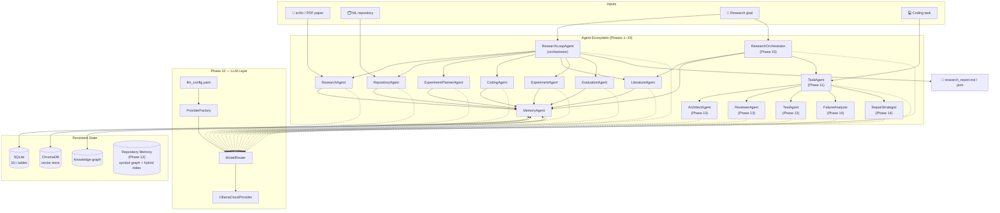

---

## Component layers

```
┌─────────────────────────────────────────────────────────────────┐
│  CLI Layer  (Typer — 56 commands across 7 sub-apps)             │
├─────────────────────────────────────────────────────────────────┤
│  Agent Layer  (23 agents + frameworks + _llm_support.resolve_llm)│
│   Phases 1–9: ResearchAgent · RepositoryAgent ·                 │
│   ExperimentPlannerAgent · CodingAgent · MemoryAgent ·          │
│   LiteratureAgent · ExperimentAgent · EvaluationAgent ·         │
│   ResearchLoopAgent                                              │
│   Phase 11: TaskAgent                                            │
│   Phase 13: ArchitectAgent · ReviewerAgent · TestAgent           │
│   Phase 14: FailureAnalyzer · RepairStrategist                   │
│   Phase 15: 7 ResearchStage agents + ResearchOrchestrator        │
├─────────────────────────────────────────────────────────────────┤
│  Tool Layer  (61 typed tools, Tool[Input, Output] ABC)          │
│   Phases 1–15 each contribute tools                               │
├─────────────────────────────────────────────────────────────────┤
│  LLM Layer  (Phase 10 — provider-agnostic)                     │
│   LLMProvider ABC · OllamaCloudProvider · ProviderFactory      │
│   ModelRouter · _BoundProvider · resolve_llm                   │
├─────────────────────────────────────────────────────────────────┤
│  Domain Layer  (186 Pydantic models across 18 modules)         │
├─────────────────────────────────────────────────────────────────┤
│  Infrastructure Layer                                          │
│   SQLite · ChromaDB · arXiv API · PyMuPDF · AST · httpx       │
│   Semantic Scholar API · TerminalTool                           │
└─────────────────────────────────────────────────────────────────┘
```

---

## Phase pipeline

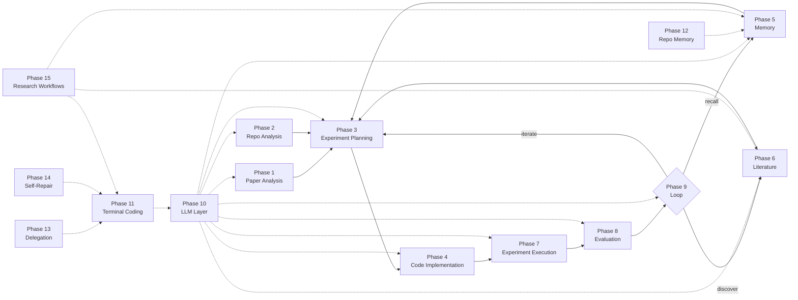

### Phase summary

| Phase | Name | Agent | Tools | Models | Key output |
|-------|------|-------|-------|--------|------------|
| 1 | Paper Analysis | ResearchAgent | 4 | 6 | `output/<paper_id>_summary.json`, `_plan.json` |
| 2 | Repository Analysis | RepositoryAgent | 7 | 22 | `output/<repo>/` docs + knowledge graph |
| 3 | Experiment Planning | ExperimentPlannerAgent | 8 | 27 | `output/plans/<paper>_<repo>/` (8 .md + JSON) |
| 4 | Code Implementation | CodingAgent | 8 | 18 | `output/<impl_id>/` patches + tests + reports |
| 5 | Research Memory | MemoryAgent | 12 | 21 | SQLite memories + ChromaDB + knowledge graph |
| 6 | Literature Intelligence | LiteratureAgent | 7 | 38 | `output/literature/<topic>_<ts>/` |
| 7 | Experiment Execution | ExperimentAgent | 6 | 30 | `output/experiments/<exp_id>/` |
| 8 | Evaluation | EvaluationAgent | 5 | 22 | `output/evaluations/<eval_id>/` |
| 9 | Autonomous Loop | ResearchLoopAgent | 3 | 22 | `output/loops/<loop_id>/research_report.*` |
| 10 | LLM Layer | — | 4 | 6 | `llm_config.yaml` + provider routing |
| 11 | Terminal-First Coding | TaskAgent | 1 (7 ops) | 6 | `output/tasks/<task_id>/` |
| 12 | Repository Memory | RepositoryMemory | 7 | 10 | `data/repo_memory/` symbol index |
| 13 | Multi-Agent Delegation | DelegationFramework | 3 | 6 | Delegated task results |
| 14 | Autonomous Self-Repair | SelfRepairFramework | 3 | 8 | Repair reports |
| 15 | Research Workflows | ResearchOrchestrator | 9 | 14 | `output/research/<wf_id>/research_report.md` |

---

## Phase 1 — Paper Analysis

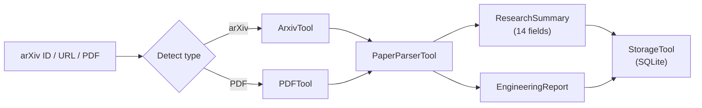

- **Input detection:** regex on arXiv ID (`^\d{4}\.\d{5}$`), arXiv URL, or `.pdf` path.
- **Rule-based extraction** — no LLM cost for Phases 1–3.
- **Output:** 14-field `ResearchSummary` + `EngineeringReport` (complexity, files, effort, dependencies).

---

## Phase 2 — Repository Analysis

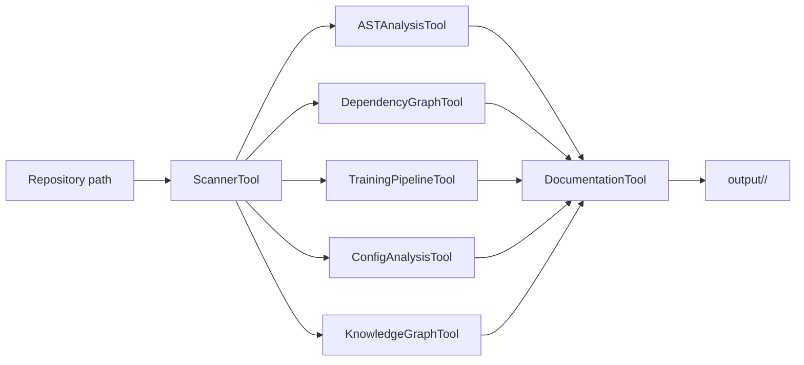

Produces architecture overview, file-importance rankings, dependency graph, training-pipeline extraction, config analysis (YAML/JSON/TOML), knowledge graph, and generated markdown docs.

---

## Phase 3 — Experiment Planning

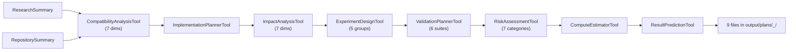

**7 compatibility dimensions:** architecture, API, data, compute, training, inference, deployment.
**5 experiment groups:** baseline, minimum-viable, ablation, stress, scaling.
**6 validation suites:** unit, integration, numerical-equivalence, regression, performance, checkpoint-compatibility.

---

## Phase 4 — Code Implementation

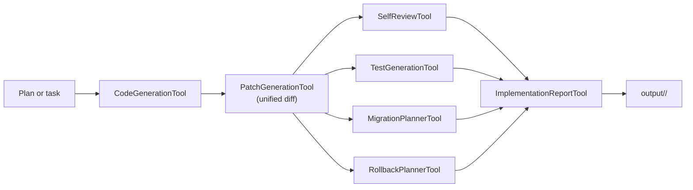

**Patch-first philosophy:** patches are generated for review, never applied by default. Application is a separate, explicit, approval-gated step (`PatchApplicationTool`).

---

## Phase 5 — Research Memory

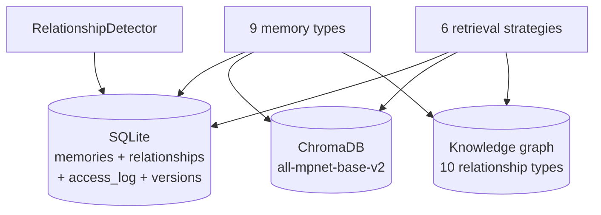

See [Memory System](memory_system.md) for the full deep dive.

---

## Phase 6 — Literature Intelligence

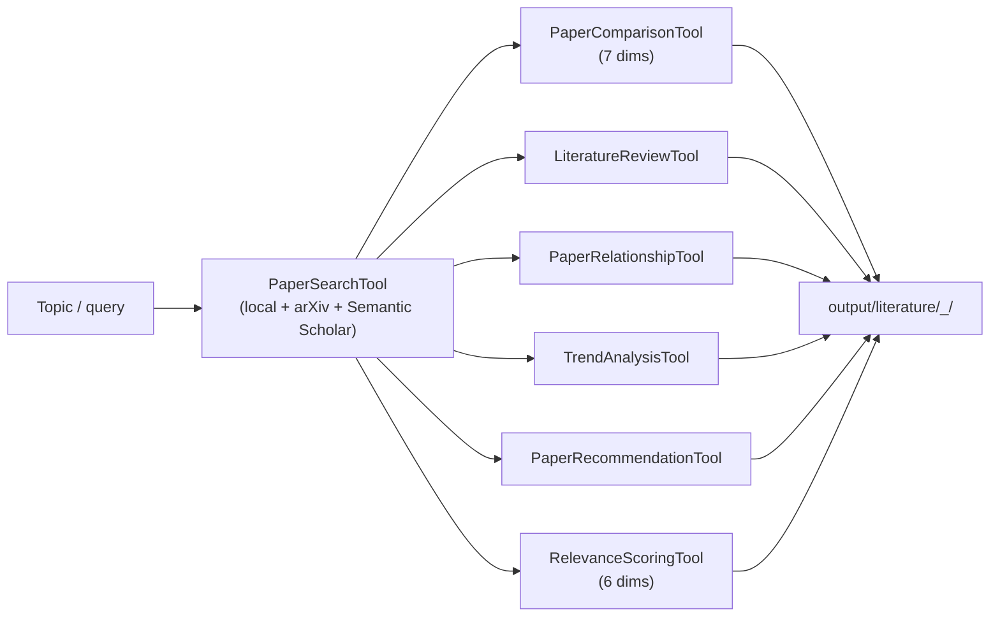

---

## Phase 7 — Experiment Execution

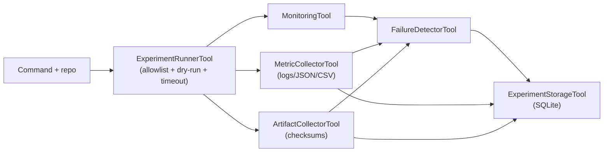

**Safety:** dry-run default, command allowlist (`python`, `python3`, `torchrun`, `accelerate`, `pytest`, `bash`, `sh`, `make`, `uv`, `pip`), timeouts, working-directory confinement.

---

## Phase 8 — Evaluation

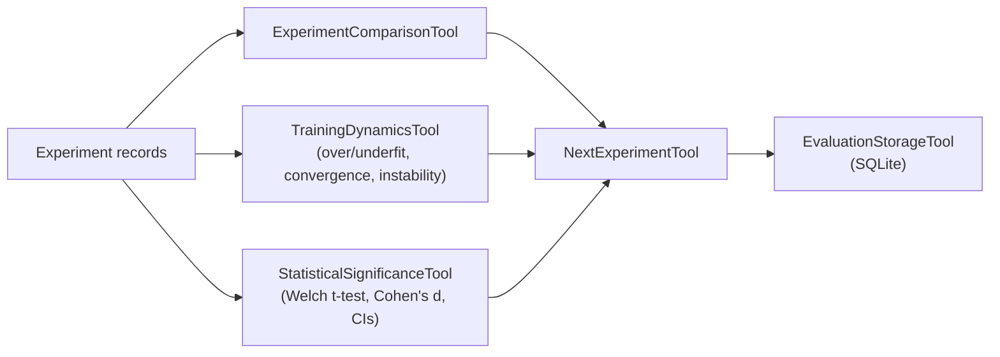

Statistical tests are **pure Python** (no SciPy dependency): Welch's t-test, Cohen's d, 95% confidence intervals.

---

## Phase 9 — Autonomous Research Loop

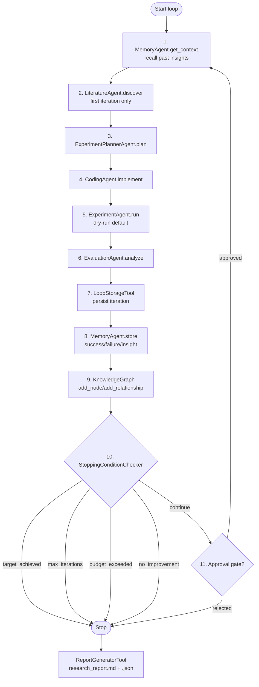

**Loop state machine:** `created → running → iterating → evaluated → stopped` (with `awaiting_approval` when approval gates are enabled).

**Stopping conditions:** `target_achieved`, `max_iterations_reached`, `budget_exceeded`, `no_improvement`.

**Approval gates:** `plan`, `implementation`, `next_iteration`.

---

## Phase 10 — Provider-Agnostic LLM Layer

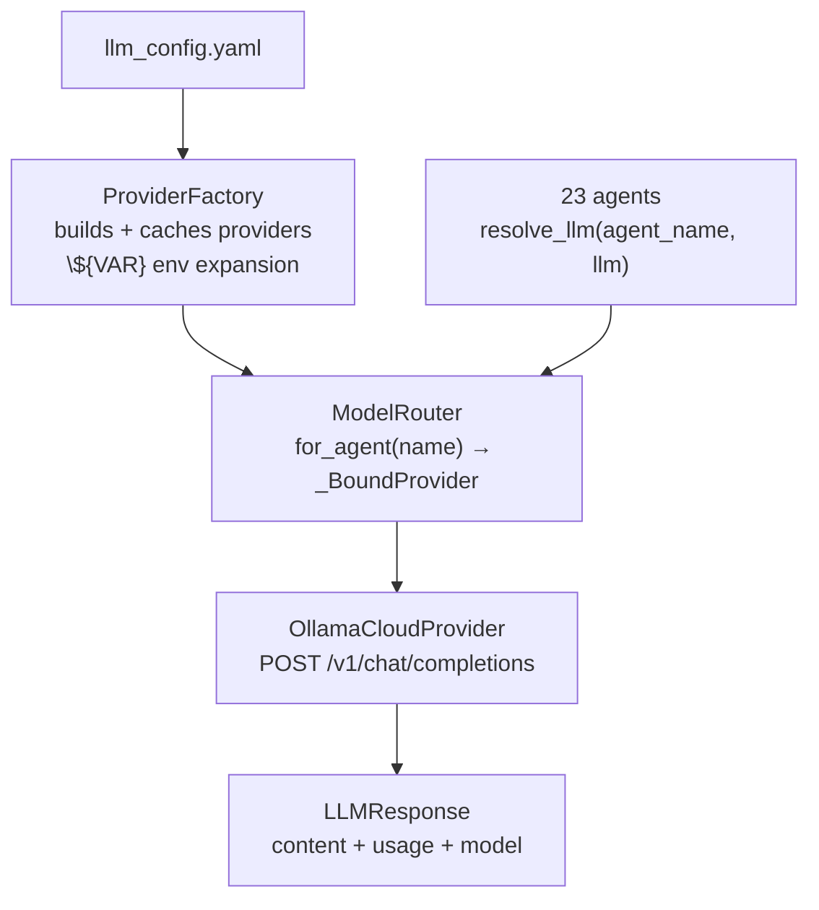

**Resolution rules:**
1. Explicit `LLMProvider` passed to an agent constructor wins.
2. `llm_enabled=False` → no provider attached.
3. Otherwise `ModelRouter.for_agent(agent_name)` resolves from `llm_config.yaml`.

See [LLM Integration](llm_integration.md) for the full guide.

---

## Phase 11 — Terminal-First Autonomous Coding

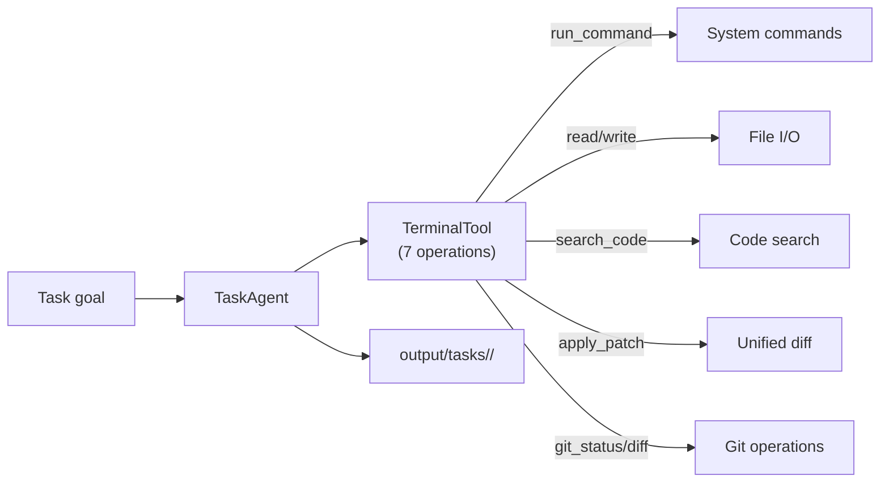

**7 TerminalTool operations:** `run_command`, `read_file`, `write_file`, `search_code`, `apply_patch`, `git_status`, `git_diff`.

**TaskAgent workflow:** analyze goal → plan steps → implement via TerminalTool → generate diff → (optionally) run tests.

---

## Phase 12 — Repository Memory

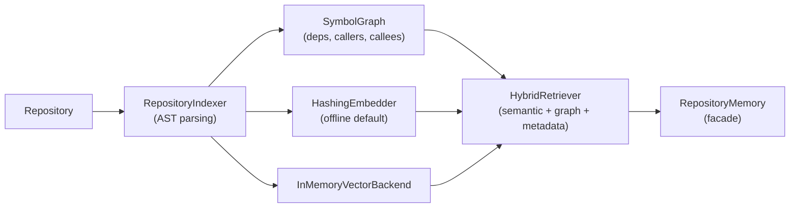

**Components:** `RepositoryIndexer` (AST-based symbol extraction), `SymbolGraph` (dependency, caller/callee, related, test relations), `HashingEmbedder` (lightweight offline embeddings), `InMemoryVectorBackend` (no heavy deps), `HybridRetriever` (combines semantic + graph + metadata).

**Persistent storage:** SQLite-backed `RepositoryMemoryStore` with incremental refresh support.

---

## Phase 13 — Multi-Agent Delegation

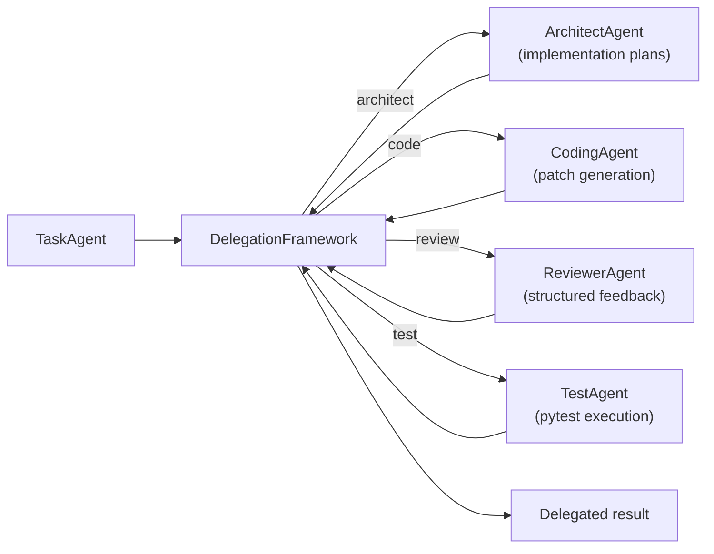

**Key types:** `AgentRole` (Architect, Reviewer, Tester), `AgentCapability` (CodeGeneration, CodeReview, TestExecution, etc.), `SharedTaskContext` for inter-agent communication.

Delegation mode is enabled via `TaskAgent` with the `--delegate` flag.

---

## Phase 14 — Autonomous Self-Repair

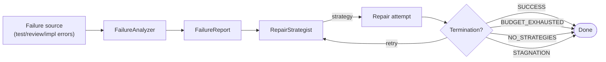

**4 termination conditions:** `SUCCESS`, `BUDGET_EXHAUSTED`, `NO_STRATEGIES`, `STAGNATION`.

**Components:** `FailureAnalyzer` (diagnoses failures → structured `FailureReport`), `RepairStrategist` (generates ranked repair strategies), `SelfRepairFramework` (coordinates the loop with configurable retry budget).

---

## Phase 15 — End-to-End Research Workflows


**7 research stage agents**, each skippable via `ResearchConfig.skip_stages`:
1. `LiteratureDiscoveryAgent` — discovers relevant papers and generates a literature review.
2. `KnowledgeSynthesisAgent` — synthesizes key findings, gaps, and trends from discovered papers.
3. `HypothesisGeneratorAgent` — generates testable hypotheses from knowledge synthesis.
4. `ResearchExperimentPlannerAgent` — designs experiments to test hypotheses.
5. `ExperimentExecutorAgent` — executes experiments (dry-run default for safety).
6. `ResultAnalyzerAgent` — analyzes experiment results and updates hypothesis status.
7. `ReportGeneratorAgent` — generates the final research report with evidence and conclusions.

---


## Data flow

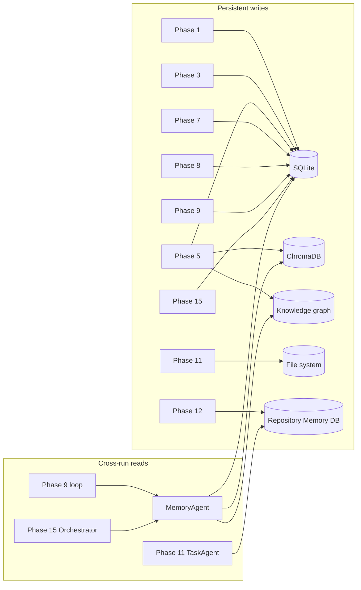

Every agent that stores a memory also calls `MemoryKnowledgeGraph.add_relationship()`, so the graph stays consistent without manual wiring. The loop's first step is always `MemoryAgent.get_context()` — it recalls relevant past insights before planning the next iteration.

---

## Storage overview

The platform persists to **three backends**:

| Backend | Purpose | Location |
|---------|---------|----------|
| **SQLite** | Structured records (papers, plans, memories, relationships, experiments, evaluations, loops, iterations) | `data/research_engineer.db` |
| **ChromaDB** | Vector embeddings for semantic memory search | `data/vector_store/` |
| **Knowledge graph** | Typed, weighted relationships between memories | in-memory + SQLite relationships table |

See [Storage Schema](storage_schema.md) for every table and column.

---

## Project structure

```
src/research_engineer/
├── agents/      # 23 agents + delegation + self-repair + research workflow + _llm_support.py
├── llm/          # Phase 10: base, ollama_provider, factory, router
├── memory/       # Phase 12: indexer, symbol_graph, retriever, storage
├── models/       # 186 Pydantic models across 18 modules
├── tools/        # 61 typed tools
└── cli/          # 56 Typer commands
tests/            # 45+ test files, 878 tests
llm_config.yaml   # provider + per-agent model config
docs/             # this documentation set
```

See [System Design](system_design.md) for the full file tree.

---

## Testing strategy

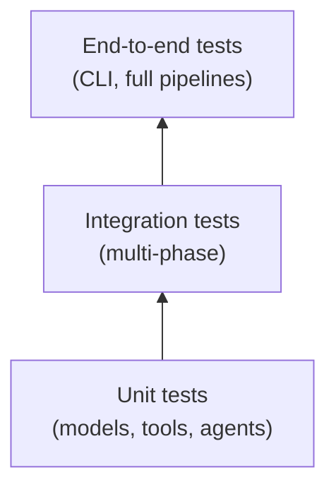

- **878 tests** across 45+ files.
- Every phase has dedicated model, tool, agent, and CLI test files.
- `test_integration.py` and `test_integration_phases.py` cover end-to-end pipelines.
- `test_llm.py` (29 tests) covers the LLM layer with a mock httpx transport.
- Phase-specific tests: 60 task/terminal, 51 repo memory, 31 delegation, 31 self-repair, 39 research workflow.

```bash
uv run pytest -q          # 878 passed
uv run mypy src/research_engineer/llm   # clean
uv run ruff check .       # lint
```

---

## Dependencies

**Core:** `pydantic>=2.0`, `typer>=0.12`, `httpx>=0.26`, `pymupdf>=1.23`, `arxiv>=2.0`, `numpy`, `chromadb`, `sentence-transformers`.

**Dev:** `pytest>=8.0`, `pytest-asyncio>=0.23`, `ruff>=0.6`, `mypy>=1.11`, `pytest-cov`.

**Python:** ≥ 3.12. **Build:** hatchling. **Package manager:** uv (recommended).

---

*Version: 2.0 · Phase 15 complete · 878 tests passing*