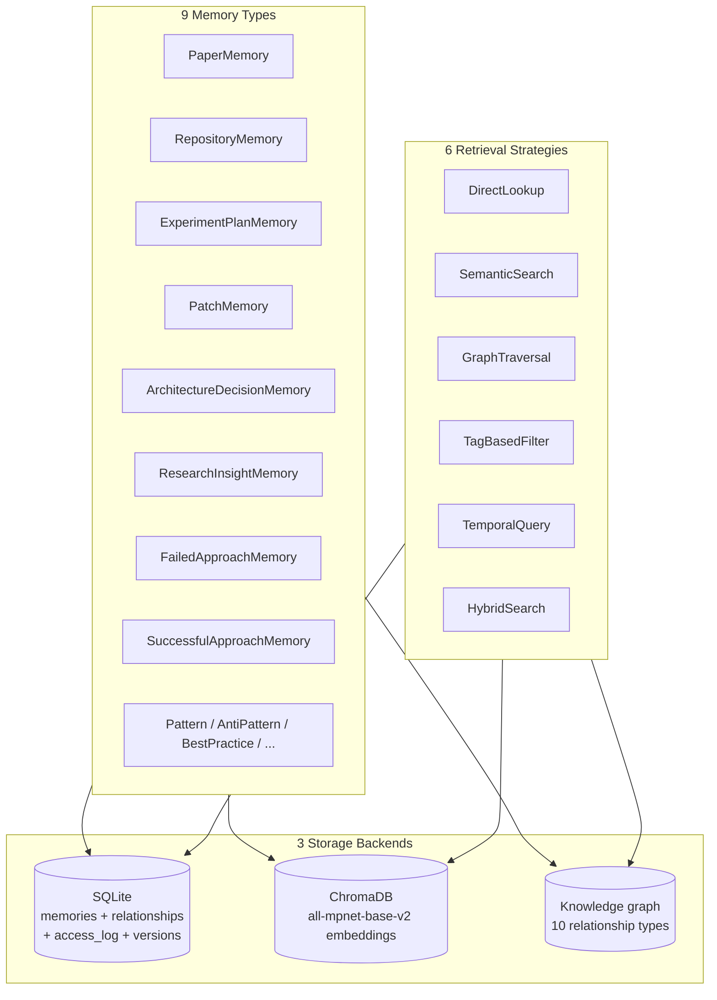
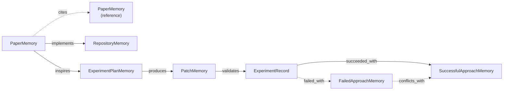
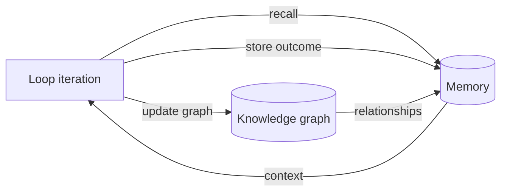

# Memory System

Deep dive into the Autonomous ML Research Engineer's memory system (Phase 5) — the platform's long-term brain. It persists across runs and powers cross-run learning in the autonomous loop.

> See [Storage Schema](storage_schema.md) for table definitions and [Agents](agents.md) for the `MemoryAgent` API.

---

## Overview

The memory system has three backends and six retrieval strategies:



---

## Memory types

`MemoryType` enum (29 values) grouped into categories:

### Core entity memories

| Type | Description |
|------|-------------|
| `PAPER` | A paper analysis result. |
| `REPOSITORY` | A repository analysis result. |
| `EXPERIMENT_PLAN` | An experiment plan from Phase 3. |
| `PATCH` | A code patch from Phase 4. |
| `ARCHITECTURE_DECISION` | An architectural decision record. |

### Insight memories

| Type | Description |
|------|-------------|
| `RESEARCH_INSIGHT` | A general research insight. |
| `PATTERN` | A recurring pattern. |
| `ANTI_PATTERN` | A pattern to avoid. |
| `OPTIMIZATION` | An optimization technique. |
| `BEST_PRACTICE` | A best practice. |
| `EMPIRICAL_FINDING` | An empirical result. |
| `THEORETICAL_RESULT` | A theoretical result. |
| `IMPLEMENTATION_TRICK` | An implementation trick. |
| `HYPERPARAMETER_GUIDELINE` | A hyperparameter guideline. |

### Outcome memories

| Type | Description |
|------|-------------|
| `FAILED_APPROACH` | An approach that failed. |
| `SUCCESSFUL_APPROACH` | An approach that succeeded. |

### Failure-mode memories (`InsightType`)

`CRASH`, `DIVERGENCE`, `POOR_PERFORMANCE`, `MEMORY_OVERFLOW`, `NUMERICAL_INSTABILITY`, `GRADIENT_EXPLOSION`, `GRADIENT_VANISHING`, `OVERFITTING`, `UNDERFITTING`, `DATA_CORRUPTION`, `CHECKPOINT_FAILURE`, `DISTRIBUTION_SHIFT`, `API_INCOMPATIBILITY`, `DEPENDENCY_CONFLICT`

---

## Storage backends

### SQLite (structured records)

Four tables (see [Storage Schema](storage_schema.md)):

| Table | Purpose |
|-------|---------|
| `memories` | Memory records (id, type, content_json, embedding_key, tags, confidence_score, is_archived). |
| `memory_relationships` | Typed edges (source, target, relationship_type, confidence, validated). |
| `memory_access_log` | Access audit (memory_id, access_type, accessed_by, context). |
| `memory_versions` | Memory versioning (memory_id, version_number, content_json, change_summary). |

### ChromaDB (vector embeddings)

- **Embedding model:** `sentence-transformers/all-mpnet-base-v2`
- **Managed by:** `EmbeddingStrategy` (`EmbeddingConfig`)
- **Store:** `ChromaVectorStore` (implements `VectorStore`)
- **Location:** `data/vector_store/`
- **Fallback:** gracefully degrades to `None` if ChromaDB is unavailable.

### Knowledge graph

`MemoryKnowledgeGraph` — a directed, typed, weighted graph:

- **Nodes:** memories.
- **Edges:** `MemoryRelationship` records with `RelationshipType` + confidence.
- **Stats:** `GraphStats` (node_count, edge_count, density, avg_degree, connected_components, most_central, relationship_counts).

---

## Relationship types

`RelationshipType` enum (10 values):

| Type | Meaning |
|------|---------|
| `CITES` | Source paper cites target. |
| `IMPLEMENTS` | Source implements target (paper→repo, plan→paper). |
| `EXTENDS` | Source extends target. |
| `SIMILAR_TO` | Source is similar to target. |
| `DEPENDS_ON` | Source depends on target. |
| `CONFLICTS_WITH` | Source conflicts with target. |
| `VALIDATES` | Source validates target (experiment→plan). |
| `FAILED_WITH` | Source failed with target approach. |
| `SUCCEEDED_WITH` | Source succeeded with target approach. |
| `INSPIRED_BY` | Source inspired by target. |



Edges are added **automatically** — every agent that stores a memory also calls `MemoryKnowledgeGraph.add_relationship()`. `RelationshipDetector` infers links between new and existing memories.

---

## Retrieval strategies

Six strategies, all subclassing `RetrievalStrategy` and registered in `STRATEGY_REGISTRY`:

| Strategy | Backend | Use case |
|----------|---------|----------|
| `DirectLookupStrategy` | SQLite | Fetch by exact memory ID. |
| `SemanticSearchStrategy` | ChromaDB | Find similar memories by embedding similarity. |
| `GraphTraversalStrategy` | Knowledge graph | Find related memories by traversing edges. |
| `TagBasedFilterStrategy` | SQLite | Filter by tags. |
| `TemporalQueryStrategy` | SQLite | Time-based retrieval (recent, range). |
| `HybridSearchStrategy` | All three | Blend semantic + graph + tag signals. |

`get_strategy(name)` resolves a strategy from `STRATEGY_REGISTRY`. `HybridSearchStrategy` is the default for `MemoryAgent.search()` and `get_context()`.

---

## MemoryAgent API

```python
from research_engineer.agents import MemoryAgent
from research_engineer.models.memory import MemoryFilters, MemoryType

agent = MemoryAgent()  # uses MemoryConfig defaults

# Store
mid = await agent.store_paper(paper, summary, plan)
mid = await agent.store_repository(repo, analysis)
mid = await agent.store_plan(plan_result)
mid = await agent.store_patch(...)
mid = await agent.store_insight(content="RoPE helps long context", insight_type="IMPLEMENTATION_TRICK", confidence=0.85, tags=["rope","attention"])
mid = await agent.store_failure(content="LR=1e-3 diverged", failure_mode="DIVERGENCE", context="...", tags=["lr"])
mid = await agent.store_success(content="LR=2e-5 converged", outcome="SUCCESS", context="...", tags=["lr"])

# Retrieve
mem = await agent.retrieve(memory_id)
results = await agent.search("rotary embeddings", filters=MemoryFilters(memory_type=MemoryType.RESEARCH_INSIGHT), limit=10)
context = await agent.get_context("Improve long-context stability", limit=5)  # used by the loop
related = await agent.get_related(memory_id, max_depth=2)
stats = await agent.get_stats()
```

### MemoryConfig

| Field | Default | Description |
|-------|---------|-------------|
| `db_path` | `data/research_engineer.db` | SQLite path. |
| `vector_store_path` | `data/vector_store` | ChromaDB path. |
| `embedding_model` | `sentence-transformers/all-mpnet-base-v2` | Embedding model. |
| `auto_consolidate` | `True` | Auto-merge duplicate/similar memories. |
| `auto_detect_relationships` | `True` | Auto-run `RelationshipDetector`. |
| `min_relationship_confidence` | `0.7` | Min confidence for auto-detected edges. |
| `batch_size` | `32` | Batch size for operations. |
| `log_access` | `True` | Log every memory access. |

---

## How the loop uses memory

The autonomous loop (Phase 9) uses memory in two ways:

1. **Recall** — every iteration starts with `MemoryAgent.get_context(goal)`, which runs `HybridSearchStrategy` to find the most relevant past insights, failures, and successes.
2. **Store** — every iteration ends by storing the outcome (`store_success` / `store_failure` / `store_insight`) and updating the knowledge graph (`add_node` + `add_relationship`).

This creates a feedback loop: the platform learns from each run and applies that knowledge to the next.



---

## Memory tools (agent-facing)

Three tools wrap `MemoryAgent` for use by other agents:

| Tool | Input → Output | Purpose |
|------|----------------|---------|
| `MemoryQueryTool` | `MemoryQueryToolInput → MemoryQueryToolOutput` | Query memories. |
| `MemoryWriteTool` | `MemoryWriteToolInput → MemoryWriteToolOutput` | Write memories. |
| `MemoryRecallTool` | `MemoryRecallToolInput → MemoryRecallToolOutput` | Recall context for a task. |

---

*Version: 1.0 · 9 memory types · 10 relationship types · 6 retrieval strategies*