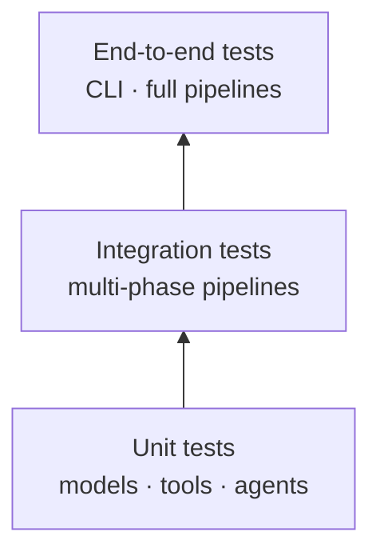

# System Design

Detailed technical design for the Autonomous ML Research Engineer v2.0. This document covers domain models, tool contracts, the LLM layer, storage schema, enums, error handling, and the testing strategy.

> See [Architecture](architecture.md) for the high-level phase pipeline and [Storage Schema](storage_schema.md) for full table definitions.

---

## 1. System boundaries

### In scope (all 10 phases)

| Phase | Capability |
|-------|------------|
| 1 | Paper acquisition (arXiv/PDF), parsing, structured summary, engineering report, SQLite storage. |
| 2 | Repository scanning, AST analysis, dependency graph, training-pipeline detection, config analysis, knowledge graph, documentation. |
| 3 | 7-dimension compatibility, implementation planning, 7-dimension impact, 5-group experiment design, 6-suite validation, 7-category risk, compute estimation, result prediction. |
| 4 | Code generation, unified-diff patches, self-review, test generation, migration + rollback planning, patch application, implementation reports. |
| 5 | 9 memory types, 10 relationship types, ChromaDB vector store, 6 retrieval strategies, relationship detection, access logging, versioning. |
| 6 | Multi-source paper search, 7-dimension comparison, structured reviews, relationship detection, trend analysis, recommendations, 6-dimension relevance scoring. |
| 7 | Subprocess runner (allowlist + dry-run + timeout), monitoring, metric collection (logs/JSON/CSV), artifact collection, failure detection, SQLite storage. |
| 8 | Experiment comparison, training-dynamics analysis, statistical significance (pure Python), next-experiment recommendations, SQLite storage. |
| 9 | Autonomous loop orchestrator: recall → discover → plan → implement → run → evaluate → store → learn → stop-check, with approval gates and reports. |
| 10 | Provider-agnostic LLM layer: `LLMProvider` ABC, Ollama Cloud provider, per-agent model routing, config-only switching. |

### Out of scope

- Distributed/multi-node experiment execution (roadmap v1.4).
- A web UI dashboard (roadmap v1.3).
- Auto-applying patches without human review (by design — patch-first).

---

## 2. Domain models

**186 Pydantic v2 models** across 18 modules. All enums use `StrEnum`. See [Models Reference](models.md) for the complete list.

### Core entities

```python
# models/paper.py
class Author(BaseModel):
    name: str
    affiliation: str | None = None

class Paper(BaseModel):
    paper_id: str
    title: str
    authors: list[Author]
    abstract: str
    url: str
    published: datetime
    content_full: str | None = None

# models/summary.py
class ResearchSummary(BaseModel):
    executive_summary: str
    problem_statement: str
    core_contributions: list[str]
    model_architecture: str
    training_methodology: str
    dataset_information: str
    evaluation_methodology: str
    key_results: list[str]
    limitations: list[str]
    reproduction_challenges: list[str]
    engineering_complexity: str
    implementation_difficulty: str
    compute_requirements: str
    hardware_requirements: str

# models/plan.py
class ComplexityMetrics(BaseModel):
    code_complexity: str
    data_requirements: str
    compute_requirements: str
    inference_complexity: str

class FileRequirement(BaseModel):
    path: str
    purpose: str
    complexity: str
    estimated_lines: int

class EngineeringReport(BaseModel):
    complexity_analysis: ComplexityMetrics
    step_by_step_implementation: str
    files_required: list[FileRequirement]
    development_effort: str
    dependencies: list[str]
    pytorch_modules: list[str]
    test_coverage_requirements: str
    benchmark_targets: list[str]
```

### Enums by phase

<details>
<summary><b>Phase 3 — Planner enums</b></summary>

```python
class CompatibilityLevel(StrEnum):    LOW; MEDIUM; HIGH
class RiskLevel(StrEnum):             LOW; MEDIUM; HIGH
class ConfidenceLevel(StrEnum):       LOW; MEDIUM; HIGH
class DifficultyLevel(StrEnum):       TRIVIAL; EASY; MODERATE; HARD
class ExperimentType(StrEnum):         BASELINE; MINIMUM_VIABLE; ABLATION; STRESS; SCALING
class ValidationTestType(StrEnum):     UNIT; INTEGRATION; NUMERICAL_EQUIVALENCE;
                                       REGRESSION; PERFORMANCE; CHECKPOINT_COMPAT
```
</details>

<details>
<summary><b>Phase 4 — Coding enums</b></summary>

```python
class ChangeType(StrEnum):      NEW_FILE; MODIFICATION; DELETION; RENAME;
                               CONFIG_UPDATE; TEST_ADDITION
class PatchStatus(StrEnum):    DRAFT; REVIEWED; APPROVED; APPLIED; REJECTED
class ReviewStatus(StrEnum):   APPROVED; CHANGES_REQUESTED; REJECTED
class RiskLevel(StrEnum):       LOW; MEDIUM; HIGH
class ComplexityLevel(StrEnum): LOW; MEDIUM; HIGH
class TestType(StrEnum):        UNIT; INTEGRATION; REGRESSION; PERFORMANCE; EDGE_CASE
```
</details>

<details>
<summary><b>Phase 5 — Memory enums</b></summary>

```python
class MemoryType(StrEnum):
    PAPER; REPOSITORY; EXPERIMENT_PLAN; PATCH; ARCHITECTURE_DECISION
    RESEARCH_INSIGHT; FAILED_APPROACH; SUCCESSFUL_APPROACH
    PATTERN; ANTI_PATTERN; OPTIMIZATION; BEST_PRACTICE
    EMPIRICAL_FINDING; THEORETICAL_RESULT; IMPLEMENTATION_TRICK
    HYPERPARAMETER_GUIDELINE
    CRASH; DIVERGENCE; POOR_PERFORMANCE; MEMORY_OVERFLOW
    NUMERICAL_INSTABILITY; GRADIENT_EXPLOSION; GRADIENT_VANISHING
    OVERFITTING; UNDERFITTING; DATA_CORRUPTION; CHECKPOINT_FAILURE
    DISTRIBUTION_SHIFT; API_INCOMPATIBILITY; DEPENDENCY_CONFLICT

class InsightType(StrEnum):
    PATTERN; ANTI_PATTERN; OPTIMIZATION; BEST_PRACTICE
    EMPIRICAL_FINDING; THEORETICAL_RESULT; IMPLEMENTATION_TRICK
    HYPERPARAMETER_GUIDELINE; CRASH; DIVERGENCE; POOR_PERFORMANCE
    MEMORY_OVERFLOW; NUMERICAL_INSTABILITY

class RelationshipType(StrEnum):
    CITES; IMPLEMENTS; EXTENDS; SIMILAR_TO; DEPENDS_ON
    CONFLICTS_WITH; VALIDATES; FAILED_WITH; SUCCEEDED_WITH; INSPIRED_BY

class ExecutionOutcome(StrEnum): SUCCESS; FAILURE; PARTIAL; TIMEOUT
```
</details>

<details>
<summary><b>Phase 6 — Literature enums</b></summary>

```python
class SearchSource(StrEnum):    LOCAL; ARXIV; SEMANTIC_SCHOLAR
class ReviewDepth(StrEnum):     BRIEF; STANDARD; COMPREHENSIVE
class PaperRelationType(StrEnum): CITATION; EXTENSION; SIMILARITY; CONTRADICTION
class TrendDirection(StrEnum):  RISING; STABLE; DECLINING
class RelevanceLevel(StrEnum):   HIGH; MEDIUM; LOW
```
</details>

<details>
<summary><b>Phase 7 — Experiment enums</b></summary>

```python
class ExperimentType(StrEnum):  TRAINING; EVALUATION; INFERENCE; ABLATION; BENCHMARK
class ExperimentStatus(StrEnum): PENDING; RUNNING; COMPLETED; FAILED; TIMEOUT; CANCELLED
class MetricType(StrEnum):      SCALAR; LOSS; ACCURACY; LATENCY; MEMORY; THROUGHPUT
class ArtifactType(StrEnum):    CHECKPOINT; LOG; METRIC_FILE; PLOT; CONFIG; OUTPUT
class FailureSeverity(StrEnum): NONE; LOW; MEDIUM; HIGH; CRITICAL
```
</details>

<details>
<summary><b>Phase 8 — Evaluation enums</b></summary>

```python
class DynamicsPatternType(StrEnum):
    OVERFITTING; UNDERFITTING; CONVERGENCE; INSTABILITY; DIVERGENCE; PLATEAU
class RecommendationPriority(StrEnum): HIGH; MEDIUM; LOW
```
</details>

<details>
<summary><b>Phase 9 — Loop enums</b></summary>

```python
class LoopStatus(StrEnum):
    CREATED; RUNNING; ITERATING; AWAITING_APPROVAL; EVALUATED; STOPPED; FAILED
class IterationPhase(StrEnum):
    LITERATURE; PLANNING; IMPLEMENTATION; EXPERIMENT; EVALUATION; DECISION
class StoppingCondition(StrEnum):
    TARGET_ACHIEVED; MAX_ITERATIONS_REACHED; BUDGET_EXCEEDED; NO_IMPROVEMENT
class ApprovalGate(StrEnum): PLAN; IMPLEMENTATION; NEXT_ITERATION
```
</details>

---

## 3. Tool layer

### Tool interface

Every tool follows a uniform generic ABC with typed input/output:

```python
# tools/base.py
from abc import ABC, abstractmethod
from typing import Generic, TypeVar
from pydantic import BaseModel

InputType = TypeVar("InputType", bound=BaseModel)
OutputType = TypeVar("OutputType", bound=BaseModel)

class ToolError(Exception):
    """Raised on tool failure; carries input_data and cause."""

class Tool(ABC, Generic[InputType, OutputType]):
    @abstractmethod
    async def execute(self, input: InputType) -> OutputType: ...

    async def validate(self, input: InputType) -> bool: ...

    async def __call__(self, input: InputType) -> OutputType:
        if not await self.validate(input):
            raise ToolError(f"Invalid input for {self.__class__.__name__}", input)
        return await self.execute(input)
```

**61 tools** implement this contract. See [Tools Reference](tools.md) for every tool's input/output and key logic.

### Caching & rate limiting

`tools/base_cache.py` provides `CacheBase`, `SimpleCache`, `FileCache`, `TokenBucketRateLimiter`, `SlidingWindowRateLimiter`, and `generate_key`. `tools/rate_limiter.py` adds `AsyncRateLimiter`.

---

## 4. LLM layer (Phase 10)

### Abstraction

```python
# llm/base.py
class LLMRole(StrEnum):    SYSTEM; USER; ASSISTANT; TOOL
class LLMMessage(BaseModel): role; content; name?; tool_call_id?
class LLMRequest(BaseModel): messages; model?; temperature; max_tokens?;
                             top_p; stop?; stream; extra
class LLMUsage(BaseModel):  prompt_tokens; completion_tokens; total_tokens
class LLMResponse(BaseModel): content; model; provider; usage; finish_reason?; raw
class ProviderError(RuntimeError): provider?; cause?

class LLMProvider(ABC):
    name: str
    default_model: str
    @abstractmethod
    async def complete(self, request: LLMRequest) -> LLMResponse: ...
    async def stream(self, request: LLMRequest) -> Any: ...   # optional
    async def validate(self, request: LLMRequest) -> bool: ...
```

### Ollama Cloud provider

`OllamaCloudProvider` speaks Ollama Cloud's OpenAI-compatible Chat Completions endpoint over `httpx` — no LlamaIndex, no vendor SDK.

- `POST {base_url}/v1/chat/completions`
- Bearer auth via `OLLAMA_API_KEY`
- Env fallbacks: `OLLAMA_BASE_URL`, `OLLAMA_MODEL`/`OLLAMA_DEFAULT_MODEL`, `OLLAMA_TIMEOUT`
- Streaming via SSE (`data: [DONE]` termination)
- Injectable `httpx.AsyncClient` (for tests)

### Factory & router

```python
# llm/factory.py
class ProviderFactory:
    def initialize(self) -> None: ...        # parse config, build providers + specs
    def get_provider(self, name?) -> LLMProvider: ...
    def get_spec(self, agent_name) -> AgentModelSpec: ...
    def reset(self) -> None: ...            # tests

def load_config(path?) -> dict: ...         # YAML, ${VAR} env expansion
def get_factory(config?) -> ProviderFactory: ...  # singleton
def register_provider_type(type_name, cls): ...    # plugin point

# llm/router.py
class _BoundProvider(LLMProvider):
    """Pins model on every request whose model is None."""
    async def complete(self, request) -> LLMResponse: ...

class ModelRouter:
    KNOWN_AGENTS = (9 agent names)
    def for_agent(self, agent_name) -> LLMProvider: ...   # cached _BoundProvider
    def model_for(self, agent_name) -> str | None: ...
    def provider_name_for(self, agent_name) -> str | None: ...

def get_router(factory?) -> ModelRouter: ...  # singleton
```

### Agent integration

```python
# agents/_llm_support.py
def resolve_llm(agent_name, explicit, llm_enabled=True, router=None) -> LLMProvider | None:
    # 1. explicit wins
    # 2. llm_enabled=False → None
    # 3. router.for_agent(agent_name)
```

Every agent constructor accepts `llm: LLMProvider | None = None` and sets `self.llm_provider = resolve_llm(self.agent_name, llm)`. **No agent instantiates a model directly.**

See [LLM Integration](llm_integration.md) for configuration and usage.

---

## 5. Storage layer

### SQLite schema (8 tables)

| Table | Phase | Purpose |
|-------|-------|---------|
| `papers` | 1 | Analyzed papers (id, paper_id, title, authors_json, summary_json, plan_json) |
| `plans` | 3 | Experiment plans (plan_id, paper_id, repo_path, 7×*_json, engineering_report_md) |
| `memories` | 5 | Memory records (memory_id, memory_type, content_json, embedding_key, tags, confidence_score, is_archived) |
| `memory_relationships` | 5 | Typed edges (source, target, relationship_type, confidence, validated) |
| `memory_access_log` | 5 | Access audit (memory_id, access_type, accessed_by, context) |
| `memory_versions` | 5 | Memory versioning (memory_id, version_number, content_json, change_summary) |
| `experiments` | 7 | Experiment runs (experiment_id, paper_id, plan_id, command_json, status, metrics_json, failure_mode, ...) |
| `evaluations` | 8 | Evaluation records (evaluation_id, experiment_ids_json, comparison_json, dynamics_json, significance_json, ...) |
| `research_loops` | 9 | Loop records (loop_id, goal, config_json, status, iteration_count, best_metric_value, stopping_condition) |
| `loop_iterations` | 9 | Per-iteration records (iteration_id, loop_id, phase, plan_id, experiment_id, metrics_json, improvement, decision) |

See [Storage Schema](storage_schema.md) for every column.

### Vector store

`ChromaVectorStore` wraps ChromaDB with `sentence-transformers/all-mpnet-base-v2` embeddings. Used by `MemoryAgent` for semantic search. Falls back gracefully if ChromaDB is unavailable.

### Knowledge graph

`MemoryKnowledgeGraph` is a directed, typed, weighted graph. Nodes are memories; edges are `MemoryRelationship` records with `RelationshipType` and a confidence score. `GraphStats` reports node/edge counts, density, average degree, connected components, most-central nodes, and edge counts by type.

---

## 6. Error handling

```python
class ToolError(Exception):
    def __init__(self, message, input_data=None, cause=None): ...
```

- Every tool raises `ToolError` on failure, carrying the offending input and the underlying cause.
- `LLMProvider` failures raise `ProviderError(provider=..., cause=...)`.
- Agents catch tool errors and degrade gracefully (e.g. `RepositoryAgent` LLM analysis returns `None` on any exception).
- The loop wraps each iteration in a try/except; on error it records a `FAILED` iteration and (if `stop_on_error`) stops the loop.

---

## 7. CLI layer

**56 commands** across 7 Typer sub-apps: `core`, `memory`, `literature`, `experiment`, `evaluate`, `loop`, `llm`. See [CLI Reference](cli_reference.md).

Global agent instances are lazily constructed by `_get_*()` helpers in `cli/__init__.py`.

---

## 8. Testing strategy



| Layer | Test files | Focus |
|-------|-------------|-------|
| Models | `test_models.py`, `test_planner_models.py`, `test_memory_models.py`, `test_literature_models.py`, `test_experiment_models.py`, `test_evaluation_models.py`, `test_loop_models.py` | Pydantic validation, serialization, enum values |
| Tools | `test_tools.py`, `test_planner_tools.py`, `test_phase4.py`, `test_memory_tools.py`, `test_literature_tools.py`, `test_experiment_tools.py`, `test_evaluation_tools.py`, `test_loop_tools.py`, `test_relationship_detector.py`, `test_retrieval_strategies.py`, `test_memory_graph.py` | Tool execute/validate, I/O contracts |
| Agents | `test_agent.py`, `test_agents.py`, `test_planner_agent.py`, `test_literature_agent.py`, `test_experiment_agent.py`, `test_evaluation_agent.py`, `test_loop_agent.py`, `test_memory_agent_integration.py` | Agent orchestration, end-to-end within a phase |
| CLI | `test_cli.py`, `test_memory_cli.py`, `test_literature_cli.py`, `test_experiment_cli.py`, `test_evaluation_cli.py`, `test_loop_cli.py` | Command parsing, output formats |
| Integration | `test_integration.py`, `test_integration_phases.py` | Cross-phase pipelines |
| LLM | `test_llm.py` (29 tests) | Provider (mock httpx transport), factory, router, agent wiring |

```bash
uv run pytest -q          # 690 passed
uv run mypy src/research_engineer/llm   # clean
uv run ruff check .       # lint
```

---

## 9. Performance targets

| Operation | Target |
|-----------|--------|
| arXiv analysis (Phase 1) | < 30 s |
| Local PDF parsing | < 10 s |
| SQLite write | < 1 s |
| CLI startup | < 1 s |

Optimization strategies: async I/O, connection pooling, caching (`SimpleCache`/`FileCache`), rate limiting.

---

## 10. Security considerations

- **Sandboxed execution** — experiment runner uses a command allowlist, dry-run default, timeouts, working-directory confinement.
- **No secrets in config** — `${VAR}` env expansion keeps API keys out of `llm_config.yaml`.
- **Input validation** — Pydantic validates all tool inputs; file paths checked for traversal.
- **No silent code mutation** — patch-first philosophy; application is explicit and approval-gated.
- **Rate limiting** — `AsyncRateLimiter` for external APIs (arXiv, Semantic Scholar).

---

## 11. Future-proofing

- **New providers:** implement `LLMProvider`, call `register_provider_type()`, add a YAML block. No agent changes.
- **New tools:** subclass `Tool[Input, Output]`, export from `tools/__init__.py`, wire into an agent.
- **New agents:** add a class with `agent_name` + `llm_provider`, register in `agents/__init__.py`, add a CLI `_get_*()` helper.
- **New retrieval strategies:** subclass `RetrievalStrategy`, register in `STRATEGY_REGISTRY`.
- **Storage migration:** SQLite → PostgreSQL is straightforward (JSON columns map to JSONB); ChromaDB can be swapped for any `VectorStore` implementation.

---

*Version: 2.0 · 15/15 phases · 878 tests*