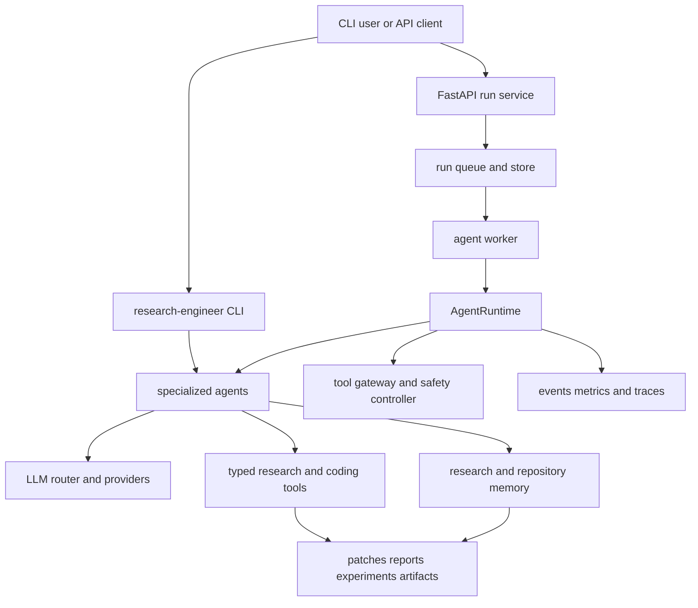

The Autonomous ML Research Engineer is an async Python platform for research and coding workflows. Its practical architecture has two complementary paths:

- **Interactive capability path:** the `research-engineer` Typer CLI constructs specialized agents for paper/repository analysis, planning, coding, experiments, evaluation, memory, and autonomous research loops.
- **Production run path:** a FastAPI API accepts an asynchronous run, and a worker drives a generic `AgentRuntime` with queue, run store, artifacts, checkpoints, safety controls, and telemetry.

This shows the two entry paths converging on agents and the runtime-facing control surfaces.

## Entrypoints and change surfaces

- **CLI:** `research-engineer` resolves to `research_engineer.cli:app`; `python -m research_engineer` invokes the same Typer application. The CLI owns command parsing and lazily created process-local agent instances. It exposes top-level research/repository/planning/coding commands plus grouped `memory`, `literature`, `experiment`, `evaluate`, `loop`, and `llm` commands. Change this boundary when adding an interactive workflow or its output format.
- **Python API:** `research_engineer` re-exports the original core agent, tool, and model surface for library consumers. The fuller `research_engineer.agents` package exports advanced orchestration, delegation/review, repair, terminal task, and research-workflow agents.
- **Service:** `research_engineer.service.serve` is the deployment entrypoint: `python -m research_engineer.service.serve api` hosts the run API, while `... worker` consumes queued runs. The API is deliberately a typed run-lifecycle boundary—not a remote prompt or arbitrary tool interface—and provides submit, status, cancel, resume, result, health, and readiness routes.

## Owned runtime domains

### Work orchestration: agents, runtime, and workflows

The **agents** layer turns a research task into typed domain work: paper and repository understanding feed experiment planning and coding; experiment execution and evaluation feed memory; loop and research-workflow agents compose these capabilities into longer-lived workflows. `TaskAgent` is the terminal-first coding composition, while architect/reviewer/test agents, delegation, and self-repair provide collaborative and repair-oriented extensions. See [Agents](/openwiki/concepts/agents.md), [Research loop](/openwiki/workflows/research-loop.md), and [Terminal task agent](/openwiki/workflows/terminal-task-agent.md).

`AgentRuntime` is the production-neutral execution kernel rather than another domain agent. Callers inject async planner, actor, observer, and evaluator functions; it runs a `plan → act → observe → evaluate` loop with budgets, cancellation, recoverable-error handling, termination reasons, correlation, and optional checkpointing. A gateway routes tool calls and a safety controller can inspect every completed step. Runtime adapters let existing agents participate without rewriting them. See [Runtime behavior](/openwiki/runtime/runtime-behavior.md).

### Intelligence substrate: LLMs, tools, and memory

The **LLM layer** is provider-agnostic. `ProviderFactory` loads `llm_config.yaml` (or `RE_LLM_CONFIG`), expands `${VAR}` values, caches provider instances, and resolves a provider/model assignment per agent; `ModelRouter` and provider implementations supply calls, streaming, resilience, and usage/cost accounting. Add a provider through the registry or add routing/configuration without coupling agents to a vendor. See [LLM layer](/openwiki/concepts/llm-layer.md) and [Configuration](/openwiki/operations/configuration.md).

The **tools layer** supplies typed, focused capabilities: ingestion and parsing, repository/AST analysis, planning and patch production, experiment lifecycle management, statistics, reports, persistence, and terminal operations. Agents should orchestrate these tools rather than embed their mechanisms. Experiment subprocess execution is separately guarded by an allowlist, working-directory requirement, timeout, and dry-run behavior; dry run is the default execution posture.

Memory has two scopes. Research memory supports cross-run research facts, relationships, and retrieval. Repository memory is repository-scoped: it indexes symbols and chunks, persists them in SQLite, constructs a symbol graph, and combines vector, graph, and metadata retrieval to provide code, dependencies, callers/callees, and tests as planning context. Its `build`, incremental `refresh`, and query/context APIs are the first extension points for code-aware agents. See [Memory](/openwiki/concepts/memory.md).

### Controlled production execution: service, gateway, safety, observability

The **service layer** separates request acceptance from execution. API state wires a run store, queue, manager, telemetry, and artifact store; worker processes construct runtimes and checkpoint stores. SQLite is the development default, while a PostgreSQL DSN selects Postgres-backed run, queue, and checkpoint infrastructure. Service settings come from environment variables and validate at startup. API authentication is optional via `RE_SERVICE_API_TOKEN`; CORS is off unless explicitly configured, request bodies are bounded, and docs/OpenAPI routes are disabled.

The **gateway and safety layers** sit *under* agent intent and *around* autonomous tool execution. `ToolGateway` is the policy boundary: registered tools pass policy, permission, budget, approval, workspace/network sandbox, execution, and result validation in order; unknown tools are denied. `SafetyController` evaluates progress and risk after runtime steps, persists its state in checkpoint metadata, and can continue, request replanning, pause for approval, or terminate. When service safety enforcement is enabled, the worker fails closed unless both gateway and controller are installed. This is policy enforcement, not a claim of operating-system isolation.

The **observability layer** is shared infrastructure, not business logic: a process-wide event bus fans structured events to optional JSONL or SQLite sinks without breaking callers when sinks fail. It adds correlation identifiers and configured privacy redaction; the runtime additionally creates tracing spans. Service telemetry and optional OpenTelemetry export build on that foundation.

### Evaluation and improvement

The **evaluation layer** runs YAML/JSON suites through a fresh real `AgentRuntime` for each case, then grades output and collects completion, budget, cost, latency, tool-call, and error metrics. It intentionally does not bypass runtime policies or gateway routing. The adjacent **improve** package mines outcomes, produces proposals, gates them, and persists improvement state; it is an optimization consumer of runtime evidence rather than part of request dispatch. See [Testing overview](/openwiki/testing/overview.md).

## Safe modification map

| If you need to change… | Start here | Preserve |
| --- | --- | --- |
| Interactive commands or human review flow | `research_engineer.cli` and the target agent | CLI agent construction and typed output contracts |
| A domain capability | an agent plus its Pydantic models and typed tools | agents orchestrate; tools own low-level mechanics |
| Model/vendor behavior | `research_engineer.llm` and `llm_config.yaml` | per-agent routing and provider error semantics |
| Autonomous loop behavior | `research_engineer.runtime`, `safety`, and `gateway` | budgets, terminal states, checkpoints, and gateway mediation |
| Hosted runs | `research_engineer.service` | API/worker separation, typed boundary, configurable persistence |
| Retrieval quality | `research_engineer.memory` | repository identity, incremental index persistence, hybrid context |
| Regression measurement | `research_engineer.eval` | evaluations execute through `AgentRuntime`, not a shortcut |

## Verification focus

The test suite mirrors these boundaries: runtime tests cover state, budgets, recovery and termination; safety and gateway tests cover policy, approval, risk, and checkpoint behavior; service API tests exercise authentication, body limits, probes, and lifecycle contracts; memory, LLM/provider, agent/workflow, and evaluation tests cover their respective facades. Run the focused test file for the boundary you changed before relying on broader integration coverage.
