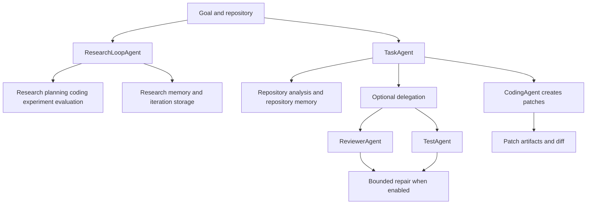
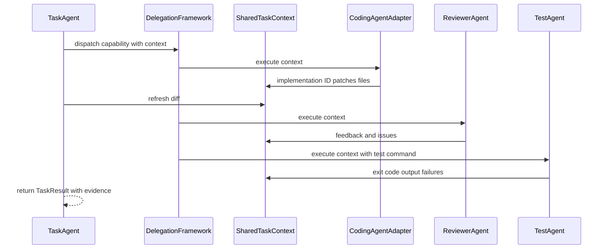

The agent layer turns a research or code-change goal into typed domain work. It is intentionally **not** the production execution kernel: agents choose and compose domain capabilities, while `AgentRuntime`, the tool gateway, and safety controls govern hosted execution. See [Architecture overview](/openwiki/architecture/overview.md) for that larger boundary and [Runtime behavior](/openwiki/runtime/runtime-behavior.md) for sampled production-run evidence.

Two orchestrators matter when changing code safely:

- `ResearchLoopAgent` owns a multi-iteration research-and-experiment program. It makes progress measurable through evaluation, budgets, stopping conditions, persistent iteration records, and optional human gates.
- `TaskAgent` owns one terminal-first coding turn against a repository. Its default posture is patch generation and inspection; application and test execution are explicit configuration choices.

The remaining agents are specialists or adapters. They contribute analysis, plans, patches, review findings, tests, memory, experiments, and evaluation results, but do not independently define the end-to-end lifecycle.

This diagram distinguishes the autonomous research program from the terminal-first change path and shows where review, testing, and repair become active.

## Ownership boundaries

| Concern | Owner | Contract and boundary |
| --- | --- | --- |
| Long-running research | `ResearchLoopAgent` | Coordinates literature, planning, implementation, experiment execution, and evaluation across iterations; stores loop/iteration records, recalls and records research memory, tracks metric/cost state, and decides whether to continue. |
| One repository change | `TaskAgent` | Converts a natural-language goal into a `TaskResult` with steps, patch/diff evidence, optional test output, and errors. It coordinates existing agents and terminal tooling rather than becoming a general research loop. |
| Patch-oriented implementation | `CodingAgent` | Produces generated code, patches, review/test/migration/rollback plans, and reports. Its contract is patch-first: `implement()` generates artifacts rather than directly modifying the target repository. |
| Architectural planning | `ArchitectAgent` | In delegation mode, adds an implementation plan to the shared task context. It does not apply or validate changes. |
| Change review | `ReviewerAgent` | Reviews the current `ctx.diff` and writes structured approval, summary, and issue fields. It reports findings; the coordinator decides whether a repair cycle follows. |
| Test execution | `TestAgent` | Executes the supplied test command through `TerminalTool`, records stdout, stderr, exit code, and parsed failures in shared context, and returns pass/fail feedback. |
| Cross-run knowledge | `MemoryAgent` and repository memory | Memory is a context source and persistence boundary, not an implicit decision-maker. Research-loop memory is recalled before planning and recorded after iterations; `TaskAgent` can build/query repository memory for code-aware planning. See [Memory](/openwiki/concepts/memory.md). |
| Low-level operations | Typed tools | Terminal commands, patch application, repository inspection, storage, reporting, and model calls are tool responsibilities. Agents orchestrate them; see [Tools](/openwiki/concepts/tools.md). |

The package exports other focused research, repository, literature, experiment-planning, experiment, and evaluation agents. They are building blocks for the two orchestration paths above, not substitutes for their lifecycle and safety decisions.

## Autonomous research loop

`ResearchLoopAgent.run(goal, repo_path, config, approval_callback)` creates a loop ID and running state, persists an initial `LoopRecord`, then repeatedly executes an iteration while the loop remains running. An iteration may use literature discovery, planning, code implementation, experiment execution, and evaluation; optional dependencies are invoked only when supplied. Literature discovery is normally skipped after the first iteration. For the complete end-to-end sequence, CLI behavior, and artifacts, see [Research loop](/openwiki/workflows/research-loop.md).

### State, evidence, and stopping

`LoopState` owns the mutable lifecycle: status, current iteration, completed iteration records, best metric, accumulated GPU-hours and estimated cost, pending approval, next experiment command, and terminal error. Each completed iteration is persisted, then its metric and cost update the state. The loop stores associated research memories and graph relationships, checks stopping conditions, and finally updates the loop record and attempts report generation.

The configuration makes the operational limits explicit: maximum iterations, target metric and direction, GPU-hour and dollar budgets, a stagnation window and threshold, dry-run experiments, and `stop_on_error`. The stopping checker can end the loop for a target reached, maximum iterations, budget exhaustion, or lack of improvement. If an iteration raises and `stop_on_error` is false, the loop records a failed iteration and may continue; otherwise it transitions to failed. Report generation failure is deliberately non-fatal to the completed loop result.

When `approval_mode` is enabled, approval gates occur after planning, implementation, and evaluation before the next iteration. The callback receives an `ApprovalRequest` with the gate, IDs, summary, available actions, and optionally plan, risk, cost, and metric context. Rejecting a gate returns a stopped iteration rather than silently proceeding. This feature alters autonomy and should be enabled where human authorization is required for expensive or risky research actions.

Memory is feedback, not control flow magic: recalled memory is compacted into text and passed to the planner and coding agent; after an iteration the loop stores successes, failures, insights, and decisions and can update relationships. Evaluation-derived results also produce a structured next-command suggestion for the next iteration.

## Terminal-first task agent

`TaskAgent.run(goal, repo_path, config)` is the narrower, safer change-making path. In its default non-delegated mode it analyzes the repository, optionally retrieves repository-memory context, plans, requests patches from `CodingAgent`, shows a diff, and runs tests only if `run_tests=True`. A repository-analysis or implementation failure produces a failed `TaskResult` with the failed step and error rather than continuing into later work. If no LLM provider is available or a planning call fails, planning falls back to a rule-based minimal plan.

`TaskConfig` defaults are important for operations:

- `dry_run=True`: generated patches are not applied by the task agent.
- `run_tests=False`: no test command runs unless explicitly requested.
- `test_command="uv run pytest"` and `timeout_seconds=600` configure optional validation.
- `stream=True` streams interactive planning output.
- `delegate=False` preserves the legacy terminal-first path.

When `dry_run=False`, `TaskAgent` invokes `PatchApplicationTool` with approval already supplied by the caller's configuration. It warns in the step summary when it applied patches without test verification. Diff collection uses `git_diff` and falls back to generated patch content when the working tree has no diff, such as in dry-run generation. These are evidence/reporting mechanisms, not a merge or deployment decision.

Repository memory is optional and failure-tolerant. When available, the agent builds an index if needed, queries up to eight relevant results, and adds its symbol/file/dependency/test context to planning; unavailable memory or retrieval errors simply yield an empty context. See [Memory](/openwiki/concepts/memory.md) for index ownership and retrieval semantics, and [Terminal task agent](/openwiki/workflows/terminal-task-agent.md) for the complete user workflow.

## Delegation changes coordination, not authority

Setting `TaskConfig.delegate=True` switches `TaskAgent` from the legacy composition to a capability-routed multi-agent coordinator. It creates one `SharedTaskContext`, registers adapters/specialists, and returns delegation metadata—including review feedback, parsed test failures, and repair count—in its `TaskResult`. Context is the only intended inter-agent channel: agents read fields they require and write their outputs back, avoiding direct calls between specialists.

The coordinator registers repository analysis, research, architecture, code generation/repair, review, and testing capabilities. The framework selects the first registered handler for a capability, records duration/output/error in a `DelegationStep`, and turns an unregistered capability into a skipped step. It catches an agent exception as a failed delegation step; a pipeline stops on failure. Therefore, adding a specialist means registering an adapter with a declared role and capability, and duplicate-capability registration is order-sensitive.

In delegated mode, repository analysis is a hard early boundary: failure finalizes the task as failed. Research output can be non-fatal, then repository memory is retrieved before architecture and coding. The coordinator obtains a diff before review/test validation. `ReviewerAgent` either uses its configured LLM or a heuristic fallback; an empty diff is approved/skipped, while the fallback flags bare `except:`, debug `print()`, unresolved `TODO`/`FIXME`, and a possible missing trailing newline. `TestAgent` uses `TerminalTool` for the configured command and recognizes pytest `FAILED`, `ERROR`, and fallback assertion messages.

This shows the shared-context contract of delegated change-making; the router records each invocation rather than allowing specialist-to-specialist control flow.

### Bounded repair is optional

Delegation enables a basic bounded review/test/repair loop. A rejected review triggers repair before testing when iterations remain; a failed test similarly triggers repair and a refreshed diff. The default maximum is two repair iterations and configuration permits 0–10. A repair uses the coding capability, so its practical authority is the same patch-generation boundary as the coding agent, not unrestricted terminal modification.

`SelfRepairFramework` is an opt-in replacement only when injected into `TaskAgent`. It classifies the current failure, generates ranked repair strategies, applies the best viable strategy through the registered repair capability, refreshes the diff, and validates required review and tests. It succeeds only when required validations pass, and terminates on success, configured iteration budget exhaustion, no strategy above the confidence threshold, or repeated-category stagnation. Because it can retry autonomous changes, enable it only with meaningful repair limits and validation requirements.

## Focused verification and extension points

Test the boundary being changed rather than treating an agent's existence as proof of safe behavior:

- `tests/test_task_agent.py` covers the legacy lifecycle, dry-run/test defaults, LLM-planning fallback, diff/test result capture, and graceful repository failure.
- `tests/test_delegation.py` covers context defaults, deterministic dispatch, skipped/unregistered and failed-agent steps, reviewer heuristics, test failure parsing, and delegated versus legacy task paths.
- `tests/test_loop_agent.py` covers loop stopping for maximum iterations, target, budget, and stagnation; memory propagation into planner/coder; persistence/report output; and error-continuation behavior.
- `tests/test_self_repair.py` is the focused suite for repair termination and validation behavior.

Safe extensions preserve the existing contracts: add a typed tool for new low-level work; add or adapt a specialist to `async execute(ctx, **kwargs)` for delegated use; register only deliberate capability ownership; and extend the relevant Pydantic context/result model when new cross-agent evidence must persist. Do not make a reviewer, tester, or memory subsystem silently apply changes or decide a loop's lifecycle—the orchestrator retains those decisions.
