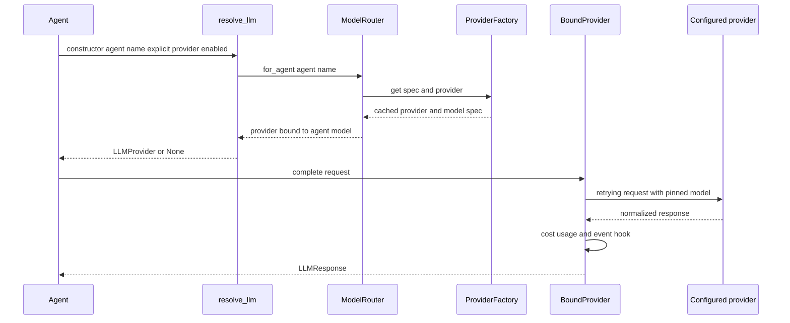

The LLM layer is the system's **change boundary for model behavior**, not a generic prompt API. Agents should receive an `LLMProvider` through `resolve_llm()` and therefore remain independent of vendor wire protocols. `ProviderFactory` owns configuration and concrete provider construction; `ModelRouter` owns the provider/model binding for an agent; the bound provider owns request-time model pinning, retry, cost accounting, and LLM-call telemetry.

For the system-wide context, see [Architecture overview](/openwiki/architecture/overview.md). For what each routed agent does and the safety implications of model quality, see [Agent system](/openwiki/concepts/agents.md). Runtime-facing LLM adapters are a separate consumer of this layer, not an exception to it.



This is the normal configured path. An explicitly injected provider wins over routing, and an agent with LLM use disabled receives `None`.

## Responsibilities and stable contracts

### Provider-neutral request boundary

`LLMProvider` is the abstraction every agent is meant to use. It accepts an `LLMRequest` composed of normalized messages, sampling/token fields, streaming intent, and provider-specific `extra` options; it returns `LLMResponse` with normalized content, model/provider identity, usage, finish reason, optional tool calls, and an opaque raw payload. The common tool schema (`ToolDefinition`, `ToolCall`, and `ToolResult`) lets providers expose native tool calling without putting vendor formats into agents.

Concrete built-ins are `OllamaCloudProvider`, `OpenAIProvider` for OpenAI-compatible endpoints, `AnthropicProvider`, and `LocalOllamaProvider`. Add a vendor by implementing `LLMProvider` and registering its configuration `type` with `register_provider_type()`; do not construct it inside an agent. Providers may implement streaming, tool calling, and health probes. Unsupported tool calling or streaming is explicitly signaled rather than silently emulated.

### Factory and router ownership

`ProviderFactory` lazily builds and caches concrete providers by their configured names, parses per-agent `AgentModelSpec` bindings, and builds the pricing table. `ModelRouter.for_agent()` returns a cached `_BoundProvider` for that agent. The wrapper supplies its configured model only when `LLMRequest.model` is unset, so ordinary agent requests inherit the route while a caller that deliberately sets `request.model` overrides that pin. Treat such per-request overrides as an exceptional, reviewable change surface: they bypass the config assignment and can invalidate pricing, capability, or safety assumptions made for the agent.

The factories and router are process-wide singletons. Configuration is read when `get_factory()` first initializes them, and per-agent bindings are cached. Therefore, edit configuration before starting a process; for an in-process test or embedding that changes configuration, call `reset_factory()` and `reset_router()` (or supply/reconfigure an explicit factory) before resolving agents again.

### Resolution order and failure posture

`resolve_llm(agent_name, explicit, llm_enabled, router)` follows a deliberately narrow order:

1. A constructor-injected `LLMProvider` wins.
2. `llm_enabled=False` returns `None` and avoids router initialization.
3. Otherwise it resolves `router.for_agent(agent_name)`.
4. Router acquisition or resolution errors are logged and converted to `None`, allowing the agent's rule-based/no-LLM fallback where it has one.

That fallback is availability-oriented, not a guarantee of equivalent output. Review every target agent's behavior before changing a route: some agents degrade to heuristic behavior, while a model-dependent workflow may surface an error later. In particular, `RepositoryAgent` defaults to `llm_enabled=False`; the CLI constructs it that way for repository analysis. Enabling it is an explicit opt-in and is not achieved merely by adding a `RepositoryAgent` entry to the YAML.

## Configuration-only routing

`llm_config.yaml` is the normal operational change surface. Its comments state the intended model/provider switch is configuration-only. `RE_LLM_CONFIG` can point to a replacement YAML; otherwise loading looks first for the repository/package `llm_config.yaml` and then the working-directory version. Missing configuration yields an empty config and the factory ultimately falls back to a stock environment-configured `OllamaCloudProvider`, so production deployments should provide an explicit, validated configuration rather than rely on that last resort.

`${VAR}` values in provider and agent configuration are expanded from the process environment. Keep API keys in environment variables such as `OLLAMA_API_KEY`, `OPENAI_API_KEY`, or `ANTHROPIC_API_KEY`; do not place literal credentials in YAML or runtime overrides. The production benchmark LLM adapter likewise does not accept credentials as overrides.

### How a route is selected

| Configuration layer | Used when | Effect |
| --- | --- | --- |
| `agents.<AgentName>.provider` and `.model` | An agent has an entry | Binds that provider name and model for ordinary requests. |
| `default_provider` and `default_model` | An agent omits either setting, including unknown agent names | Supplies the missing portion of its `AgentModelSpec`. |
| Provider `default_model` | The request has no model and the resolved spec has no model | Concrete provider selects its own default. |
| `LLMRequest.model` | A caller explicitly supplies it | Overrides the wrapper's model pin for that one request. |
| Explicit constructor `llm` | An agent is created with a provider | Replaces router resolution entirely. |

The checked-in configuration selects `ollama` as the default provider and `glm-5.3-flash` as the default model. It routes reasoning/review/research agents to `glm-5.3-flash`, coding to `kimi-k2.7-code`, and orchestration agents such as `TaskAgent`, `ResearchLoopAgent`, `ExperimentAgent`, and `TestAgent` to `minimax-m3:cloud`. Those assignments are operational defaults, not enforced capability checks. Changing a model can alter tool-use reliability, plan quality, latency, and cost, so test the workflow that owns the route—not only router unit tests.

The `pricing` mapping is USD per one million prompt and completion tokens. Config pricing overrides or extends built-in fallback prices, and matching is case-insensitive longest-prefix matching. An unknown model is recorded with `0.0` cost, which avoids fabricating a price but can make a real budget appear lower than it is. Add pricing before routing a production agent to a new paid model.

### Inspect before and after a switch

```bash
research-engineer llm status
research-engineer llm status --format json
research-engineer llm config
research-engineer llm config --config /path/to/llm_config.yaml
```

`llm status` reports defaults, configured providers, and the router's canonical agent routes. It describes configuration; it is not a live provider-health or credential validation probe. Validate connectivity and representative provider behavior separately before changing a critical agent route.

## Request behavior, observability, and hotspots

A routed `_BoundProvider` delegates ordinary and tool-enabled completion through `complete_with_retry()`. It retries transient failures up to three attempts with exponential backoff, fails fast for permanent HTTP 4xx errors other than 429, and retries a `finish_reason == "length"` response once with doubled `max_tokens` when a positive token budget was supplied (capped at 16,384). Tool-call-only responses are considered final so the retry layer does not duplicate a requested tool invocation. On exhausted transport errors it raises `ProviderError`; on repeated empty responses it returns the final empty response for the caller to handle.

Streaming through `stream_response()` assembles streamed chunks and applies the same retry classification plus the completion hook. Direct `stream()` only forwards chunks and does **not** apply the assembled-response cost/telemetry path; prefer `stream_response()` when an agent needs an accountable streamed completion.

After each completed bound call, the hook calculates `LLMUsage.cost_usd` from the factory price table, records it in the process-wide thread-safe `UsageTracker` under a `provider/model` label, and best-effort emits an LLM-call event. Hook errors are contained so observability cannot fail the model call. This usage is a runtime hotspot: `ResearchLoopAgent` adds the tracker's cost to its cumulative USD budget alongside GPU-hour estimates. Because the tracker is process-wide and cumulative, it is useful for process-level accounting but must be reset at test/run boundaries if a caller needs isolated totals.

The service `llm_react` adapter is another model-call hotspot. With no per-run model/provider override it obtains the `BenchmarkLLM` route from the same YAML/router; permitted provider/model overrides bind a configured provider and retain retry/cost behavior, while credentials remain configuration/environment owned. Its default `llm_max_tokens_per_call` is 2048 and default temperature is 0.2. For bounded tool-driven calls, `run_react_loop()` limits model calls to eight and tool calls to four per step by default, stops on `FINAL_ANSWER:`, no tool calls, or the step budget, and propagates provider/executor exceptions. These limits are safety and cost controls—preserve or consciously revise them when changing a runtime model.

Health-aware selection is opt-in: `for_agent()` uses the configured provider directly. `for_agent_with_failover()` probes all configured providers, selects the first healthy provider in configuration order, and otherwise attempts the agent's configured provider. The fallback provider still receives the agent's configured model, so only use cross-provider failover where that model identifier and request capabilities are compatible.

## Safe change map

| Desired change | Start here | Preserve and verify |
| --- | --- | --- |
| Switch one agent to a model or vendor | `llm_config.yaml` `agents.<AgentName>` | Provider exists, credentials are environment-backed, pricing is present, and the agent's actual workflow still has needed tool/stream behavior. Restart or reset cached singletons. |
| Change default for unlisted/new agents | `default_provider`, `default_model` | Unknown agent names inherit defaults; inspect `llm status` and avoid silently changing a broad population. |
| Add a provider type | Provider implementation, `LLMProvider`, then `register_provider_type()` | Normalize response/tool/usage/error semantics; test authentication, request mapping, health, and stream support. |
| Change retries, truncation, or stream accounting | `resilience.py`, `streaming.py`, and router wrapper | Permanent errors fail fast, tool calls are not duplicated, and completion hooks remain best-effort. |
| Change costs or enforce spend expectations | `pricing` and `cost.py` | Unknown models cost zero; verify usage tracking and research-loop budget effects. |
| Change production ReAct model behavior | `service/llm_agent.py` plus runtime/gateway policy | Keep credential ownership out of overrides and preserve call/token/tool limits unless intentionally re-approved. |

## Focused verification

- `tests/test_llm.py` covers normalized request/response contracts, factory defaults and environment expansion, custom provider registration, router model pinning/caching, explicit-provider precedence, disabled repository analysis, and router cost recording.
- `tests/test_providers.py` covers the OpenAI-compatible, Anthropic, and local Ollama protocol mappings, credentials/auth headers, tool calls, provider health, and opt-in health-based failover.
- `tests/test_llm_benchmark.py` covers the service ReAct adapter and a production-stack scripted-model path without credentials.

Run the focused files after a change, then run an agent/workflow test that uses the affected assignment (for example, coding/task tests after changing `CodingAgent` or `TaskAgent`). A passing provider mock alone does not establish that a replacement model safely follows the target agent's tool, patch, approval, or budget expectations.
