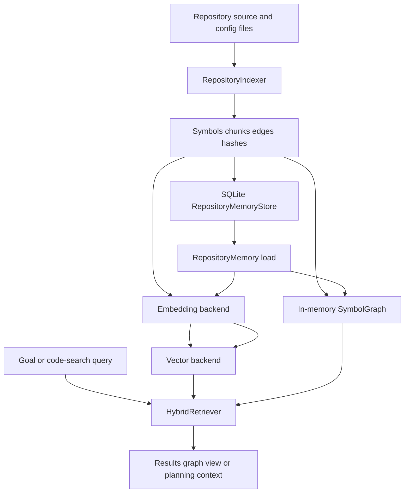

# Memory and Retrieval

Repository memory is the code-intelligence subsystem used to find change-relevant implementation context before planning. Its public boundary is `RepositoryMemory`, instantiated for one resolved repository root. A facade coordinates AST/config indexing, durable catalog storage, an in-process symbol graph, embeddings, a vector backend, and hybrid ranking; callers should use its `build()`, `refresh()`, `query()`, `graph()`, `stats()`, and `get_context()` methods rather than couple themselves to those pieces.

This is distinct from the application's broader typed-memory models in `src/research_engineer/models/memory.py`, which represent papers, plans, patches, insights, and their relationships. The subsystem described here indexes the *contents and structure of a source repository* for code search and planning.

## Lifecycle and state boundaries



*Repository source is transformed into durable catalog records and derived, query-time graph/vector structures.*

### Durable catalog

`RepositoryMemoryStore` is SQLite-backed and defaults to `data/repo_memory.db`. Its durable records are keyed by the canonical resolved `repo_path`, allowing one database to hold multiple repositories without their symbols, chunks, edges, hashes, or statistics being mixed. Persisted data includes:

- symbol metadata and repository-relative source locations;
- code-chunk source text and parent-symbol links;
- directed symbol edges;
- content hashes used to decide whether a file requires re-indexing; and
- serialized `IndexStats` plus the index timestamp.

A full `build()` indexes the repository, hydrates in-memory structures, and atomically replaces **all** catalog records for that repository. This is the reliable reconciliation operation after broad edits, moved/renamed files, or deleted files.

### Derived query state

The `SymbolGraph`, `_symbols` and `_chunks` maps, `HybridRetriever`, and default `InMemoryVectorBackend` are process-local derived state. Construction with `auto_load=True` checks for a catalog index; `load()` then reads symbols, chunks, and edges for that repository, rebuilds the graph, re-embeds the loaded chunks, and repopulates the vector backend. Thus the default vector index is not itself durable even though queryability survives a restart by reconstruction.

The optional `ChromaDBBackend` can persist vectors when configured with `persist_path`; nevertheless, normal `RepositoryMemory` hydration clears and rebuilds its vector backend from the catalog. Treat the SQLite records as the source of truth for the repository-memory index, not a Chroma collection.

## What is indexed

The indexer walks the repository while pruning known noise directories such as `.git`, virtual environments, `node_modules`, build outputs, caches, `data`, and `output`. It accepts Python plus YAML, TOML, JSON, CFG, and INI files and skips files larger than 1 MiB.

Python is parsed with `ast`. The result contains module, class, function, and method symbols, their source ranges, signatures, docstrings, decorators and flags. Each symbol has a source chunk used as the retrieval unit; module and config chunks are truncated to 8,000 characters, as are symbol chunks. Configuration files become `CONFIG` symbols/chunks rather than being ignored, so configuration can be returned by code search.

The indexer emits structural `DEFINES`/`DEFINED_IN` links and derives dependency and call relationships by resolving imports and bare/attribute call names against indexed symbols. It marks test modules and functions by path/name convention, then adds `TESTS` edges for dependencies imported by test modules. Unresolvable import targets, including external or standard-library imports, are dropped. These relationships are useful navigation evidence, not a complete language-semantic call graph: ambiguous call names can resolve to every same-named symbol.

## Refresh semantics and editing hazards

`refresh()` compares current file content hashes with the persisted hashes and re-indexes only files discovered as changed. With no changed paths, it returns stored statistics without rewriting the catalog. With changes, it merges returned symbols and chunks into the existing in-memory maps, rebuilds the vector index, and upserts catalog rows; the store replaces the repository's edge rows for consistency.

The intended invariant is **never share an index across repositories**: always construct/query with the same resolved root, and use `build()` after a path change. A second operational invariant is that a full build replaces, rather than appends to, the complete repository catalog.

There are important current limitations to account for before relying on refresh after edits:

1. **Deletion is not reconciled.** Incremental indexing walks files that still exist and only returns hashes for those files. It does not report previously indexed files that disappeared; merge/upsert logic does not delete their symbols, chunks, or hash rows. A full `build()` is required after deleting or renaming files to eliminate stale search results.
2. **Graph coverage after a partial refresh is incomplete.** The merge retains old symbols/chunks but rebuilds the in-memory graph using only `result.edges` from changed files, then persists that collection as the repository edge set. Use a full `build()` after changes whose dependency, caller, or test relationships matter for planning.
3. **Parse and I/O failures are recorded on `IndexResult.errors` and the pass continues.** Since the facade does not expose those errors in its public return value, inspect or test indexing directly when index completeness is critical. A syntax-error file can still contribute its module symbol/chunk because these are emitted before AST parsing succeeds, but it will not contribute parsed child symbols or relationships.

These constraints are especially relevant to tools or automation that interpret graph results as a complete impact analysis. Refresh is a fast content-update path, not presently a deletion-aware or whole-graph reconciliation algorithm.

## Retrieval and graph navigation

`query()` lazily builds the vector index if necessary and returns no results when no retriever or vectors are available. It accepts a result `limit`, an `include_related` switch, and vector metadata filters such as `{"kind": "function"}`. The retriever first asks the vector backend for up to 50 semantic candidates, then ranks each resolved chunk by:

1. normalized vector similarity;
2. graph proximity to the other vector hits; and
3. metadata heuristics, including symbol-name token overlap, kind preference, docstring presence, test queries, and entry-point queries.

The default weights are semantic `0.6`, graph `0.3`, and metadata `0.1`. Graph-related symbols up to a bounded two-hop traversal can be attached to each result. Default embeddings are a deterministic, dependency-free 256-dimension hashing/term-frequency representation: despite the retrieval API calling its first signal semantic, it is primarily lexical unless the optional sentence-transformer backend is selected.

`graph(symbol_name)` is for impact-oriented navigation rather than ranking. It finds a symbol by case-insensitive exact name or qualified name, falls back to substring matching, and prefers non-test classes/functions over modules/config entries. It returns dependencies, dependents, callers, callees, a two-hop related neighborhood, and tests. The `limit` parameter is accepted by the facade but is not applied to those returned lists; consumers that require bounded output must enforce it themselves.

`SymbolGraph` keeps forward and reverse adjacency sets by relation, making direct dependency/dependent and caller/callee lookup efficient. Its generic `related()` traversal treats all relation types and both directions as edges, so it intentionally supplies broad surrounding context rather than a directionally precise dependency path.

## Where retrieved context enters agents

`get_context(goal)` converts the top retrieval results into compact Markdown for a prompt: deduplicated symbols with their qualified names, locations, first docstring lines and signatures, selected dependency/caller/test names, followed by a sorted relevant-file list. It intentionally does not include retrieved source bodies. Empty retrieval produces an empty string.

`TaskAgent` retrieves this context before its planning step. If no repository-memory instance was supplied, it creates one for `cfg.repo_path`; it builds only when its store has no index, otherwise it uses the loaded catalog. Retrieval/build exceptions are swallowed and planning continues without memory. When non-empty, the Markdown is appended to the planning LLM user message and is also retained in the rule-based plan fallback. Repository memory therefore grounds planning, but does not automatically feed the later coding-agent implementation prompt; callers changing that boundary should make the handoff explicit.

## Configuration and operations

The configuration factory reads the `embedding` and `vector_store` sections through the standard LLM configuration loader, including its `RE_LLM_CONFIG` resolution behavior. With missing, unknown, unavailable, or failed optional backends it deliberately falls back to `HashingEmbedder` and `InMemoryVectorBackend`, preserving offline and CI operation.

```yaml
embedding:
  backend: sentence_transformer
  model: sentence-transformers/all-MiniLM-L6-v2
vector_store:
  backend: chromadb
  persist_path: ./data/vector_store
  collection: repository_memory
```

`sentence_transformers` and `chromadb` are optional dependencies. A configured sentence-transformer model that cannot load falls back to hashing; Chroma is selected only when available. For large repositories, replace the default brute-force in-memory backend—whose query cost is O(n*d)—with an ANN-capable backend implementing `VectorBackend` (`add`, `search`, `delete`, `count`, and `clear`). New embedders must provide compatible fixed-dimension normalized vectors and `embed_chunks`, because facade rebuilds embed every current chunk.

Operator entry points are:

- `research-engineer memory build --repo ./my_repo` for a complete replacement index;
- `research-engineer memory refresh --repo ./my_repo` only after an existing index, for changed current files; and
- `research-engineer memory query "training loop" --repo ./my_repo`, `memory symbol-graph "Trainer"`, and `memory stats` for inspection.

The CLI checks for an existing index before refresh/query/graph and supports `--format json`. Use `build`, rather than `refresh`, as the safe post-edit command after deletions, renames, or graph-sensitive refactors.

## Focused verification

`tests/test_repository_memory.py` covers AST extraction, config and test indexing, content-hash change detection, SQLite round trips, auto-load/re-query across facade instances, retrieval/context assembly, graph lookup, refresh no-op/change behavior, and TaskAgent context integration. `tests/test_memory_backends.py` covers the shared backend contracts, optional Chroma persistence, optional sentence-transformer behavior, fallback configuration, and hybrid retriever interoperability. These are the focused tests to update when changing lifecycle, ranking, persistence, or backend extension points.
