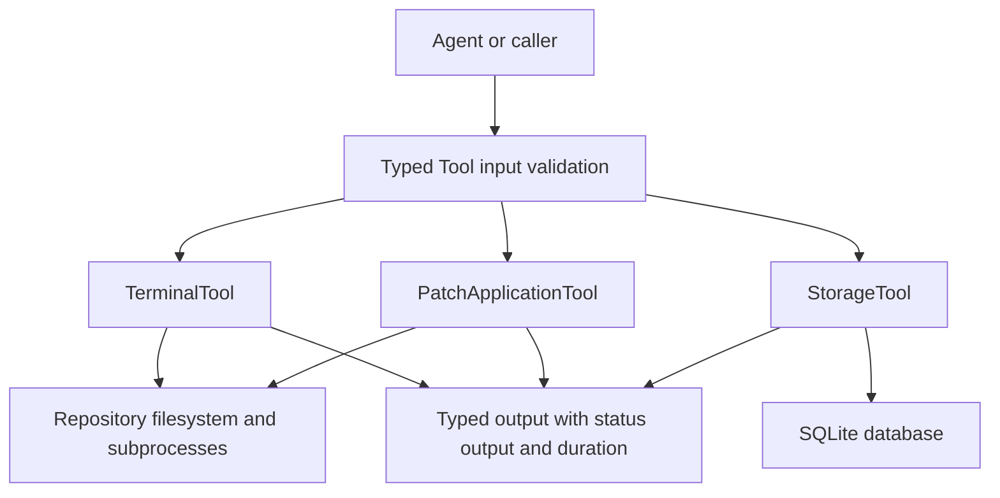

Tools are the low-level capability boundary beneath agents: an agent supplies typed input and consumes typed output, while a tool owns the I/O mechanism. The abstract `Tool` contract validates a Pydantic input before dispatching `execute()` and raises `ToolError` on invalid input; individual tools may strengthen validation. This separation lets agents compose repository work without embedding shell, filesystem, database, or patch mechanics. See [Agent System](/openwiki/concepts/agents.md) and [Architecture Overview](/openwiki/architecture/overview.md).

This page concentrates on the surfaces that mutate state or cross into the local machine: `TerminalTool`, `PatchApplicationTool`, and `StorageTool`. The package exports many additional focused analysis, planning, retrieval, reporting, experiment, and memory tools, but those exports do not give them equivalent authority.

## Boundary map

This shows the shared typed entry boundary and the distinct local state boundaries crossed by the terminal, patch, and persistence tools.

## Common tool contract and failure model

`Tool[InputType, OutputType]` makes `execute()` asynchronous and leaves tool-specific input/output models to each implementation. Calling a tool instance invokes `validate()` first; the base implementation revalidates the Pydantic model and returns `False` on validation errors or unexpected validation exceptions. A failed validation becomes `ToolError` before execution. Implementations generally use structured outputs for expected operational failures and reserve `ToolError` for invalid requests or unexpected tool failures, so callers must handle both.

The contract is an interface convention, not a sandbox. In particular, it does not introduce authorization, path policy, resource quotas, auditing, or transactionality. Hosted runtime policy enforcement belongs to the tool gateway and safety controller described in [Architecture Overview](/openwiki/architecture/overview.md); keep sampled runtime-backed, per-tool observations in [Runtime behavior](/openwiki/runtime/runtime-behavior.md), rather than treating this in-process tool code as evidence of production execution.

## TerminalTool: command, filesystem, search, patch, and Git access

`TerminalTool` is the terminal-first coding surface used by `TaskAgent`, `TestAgent`, experiment execution, and self-repair. A `TerminalInput` selects exactly one operation in practice: `run_command`, `read_file`, `write_file`, `search_code`, `apply_patch`, `git_status`, or `git_diff`. `TerminalOutput` records success, exit code, stdout/stderr, optional content or matches, modified files, duration, and an error string. The tool rejects an empty operation or a nonexistent/non-directory `repo_path`; unknown operations raise `ToolError`.

### Command execution safeguards

`run_command` is the principal subprocess boundary. It splits a string command on whitespace (or accepts a token list), checks the basename of the first token against a deliberately small allowlist, then uses `asyncio.create_subprocess_exec` with `cwd=input.repo_path` rather than a shell. The allowlist is `python`, `python3`, `pytest`, `uv`, `ruff`, `mypy`, `bash`, `sh`, `make`, `git`, `pip`, `echo`, `cat`, `ls`, `rg`, `grep`, and `find`; an unlisted program such as `rm` is rejected.

The command dry run is explicit, not global: `TerminalInput.dry_run` defaults to `False`, and only `run_command` returns the rendered command without launching it when set. Live commands use a default 300-second timeout (minimum one second); on timeout the tool kills the process and reports unsuccessful completion with exit code `-1`. Process launch errors return an unsuccessful structured output, and a nonzero process exit is reported as `success=False`. Stdout and stderr are decoded and capped at one million bytes by default, or a caller-supplied positive `max_bytes`, to bound returned data.

The allowlist constrains only the executable name, not command arguments, environment variables, or behavior of allowed interpreters and shells. `env_vars` is merged into the inherited environment. Therefore this tool is a guardrail for expected repository commands, **not** a security sandbox or a safe way to execute untrusted commands; allowing `python`, `bash`, `sh`, `make`, `git`, or `pip` deliberately preserves broad capabilities. Callers should supply a trusted repository and command, use dry run when inspection is sufficient, and rely on higher-level gateway policy for hosted execution.

### Repository operations and bounds

- `read_file` reads bytes from the requested path, rejects missing paths and non-files with an unsuccessful result, and applies the same output cap. `write_file` creates missing parent directories and overwrites the target with UTF-8 content.
- `search_code` compiles the supplied regex, recursively scans a caller-selected glob (default `*.py`), skips `.git`, `__pycache__`, `.venv`, and `node_modules`, truncates each matched line to 500 characters, and stops at `max_matches` (default 200). Invalid regexes and filesystem errors become structured failures.
- `git_status` runs `git status --porcelain`; `git_diff` runs `git diff`, appending `--cached` when requested. Both use the repository as their current directory, a fixed 30-second timeout, and capped captured output.
- `apply_patch` invokes system `patch` in the repository, first with `patch --dry-run -p1` (30 seconds) and only then with `patch -p1` (60 seconds). A failed validation prevents the real patch command; the result includes paths parsed from `patch` output.

`repo_path` provides a working directory for commands and relative paths, which protects normal repository-oriented workflows from accidentally running in the process default directory. It is **not path confinement**: `_resolve()` explicitly lets an absolute `file_path` win, and it does not resolve and check that a relative path remains under the repository root. Thus `read_file` and `write_file` can address an absolute path or traversal path such as `../...`; patch content and allowed commands likewise retain the authority of the process. Do not describe these APIs as repository-contained security boundaries until canonicalization plus an ancestor check (and equivalent patch/command policy) is implemented.

## PatchApplicationTool: approval-aware generated patch application

`PatchApplicationTool` applies a list of `GeneratedPatch` objects to a supplied existing repository directory. Its input defaults to a conservative workflow: `dry_run=True`, `require_approval=True`, `approved=False`, and `backup_enabled=True`. Validation requires at least one patch, an existing directory, and a nonempty diff for every patch. If required approval is absent, execution returns `application_status="rejected"` without applying anything.

For approved input, the tool orders supplied dependencies before dependents, then processes patches independently. Each patch is checked for basic target-file existence rules and, for Git-style modifications, by `patch --dry-run -p1` in the repository. In dry run, it reports the patch IDs and would-be modified file paths without writing. In a real run, it creates timestamped copies of pre-existing targets under `.patch_backups` when backups are enabled, records rollback metadata, and dispatches new-file, modification, or deletion behavior. Individual failures are collected, allowing later patches to proceed; the aggregate status distinguishes `success`, `partial_success`, `failed`, `skipped`, and `no_op`.

For Python files, new-file and in-process modification paths reject content that fails `ast.parse`. A Git-style external patch is also checked after application; if it leaves invalid Python, the tool restores the original text and marks that patch unsuccessful. Hunk-based in-process application refuses mismatched context by returning the original content. These are useful integrity checks, but they are not a complete rollback system: backup paths and applied patch IDs are returned for a caller to plan rollback, and deletion/new-file restoration is not automatically performed by `generate_rollback_plan()`.

Approval here is a caller-provided boolean, not an identity-checked authorization protocol. `TaskAgent` only invokes the applicator after its `TaskConfig.dry_run` has explicitly been disabled, but passes `require_approval=False` and `approved=True`; this makes opt-out of task dry run the effective authorization in that workflow. Patch target construction also joins `repo_path / patch.file_path` without a containment check. Treat both the repository and generated patch paths as trusted unless an outer gateway policy constrains them.

## SQLite persistence: StorageTool

`StorageTool` crosses the persistence boundary to a SQLite database, defaulting to `data/research_engineer.db`. Construction creates the database parent directory and initializes `papers` and `plans` tables plus indexes. Its implemented `execute()` path validates a paper ID, summary, and engineering report; serializes authors, summary, and plan to JSON; then upserts the `papers` row on `paper_id`, updating the title and JSON fields on conflict. It returns the database record ID and timestamp or raises `ToolError` on database failure.

The tool also exposes retrieval, descending created-time listing with `limit`/`offset`, title-or-author `LIKE` search, and deletion by paper ID. SQL value parameters are bound rather than interpolated, including the search pattern. However, `list_papers()` does not enforce an upper bound on a caller-supplied limit, the database location is configured by its caller, and connections are opened per operation; `close()` is currently a no-op. This is local persistence convenience, not a multi-process transaction manager or access-control boundary.

## Operational use and extension guidance

For a repository change, keep generation, application, inspection, and validation distinct: generate patches while task dry run is enabled, inspect the returned/generated diff, explicitly authorize application only in a trusted repository, then request tests with a trusted allowlisted command and a suitable timeout. A successful patch dry run means only that `patch` accepted the diff against the current working tree; it does not establish semantic correctness, test success, or safe deployment. Similarly, an exit code of zero is command evidence, not a policy approval.

Add a new capability by defining Pydantic input/output models, implementing `validate()` for boundary-specific preconditions, returning bounded structured evidence for expected failures, and raising `ToolError` for invalid or exceptional execution. For a state-changing tool, make dry-run semantics unambiguous, validate before mutation, state what rollback evidence is retained, and enforce a real canonical path policy if its contract promises confinement. Do not widen `ALLOWED_COMMAND_PREFIXES` merely to support a workflow: assess arguments, environment, network/process effects, runtime gateway policy, and test coverage first.

## Focused verification

`tests/test_terminal_tool.py` exercises repository validation; allowlist acceptance and rejection; command dry run, exit status, and output truncation; file reads and writes; search errors and results; Git diff/status; and clean versus failing patch application. `tests/test_production_fixes.py` specifically checks rejection of a non-parsing Python new-file patch, correct hunk insertion/replacement, and refusal when hunk context does not match. These focused tests establish the in-process behavior described above; they do not prove OS-level isolation or production gateway enforcement.
