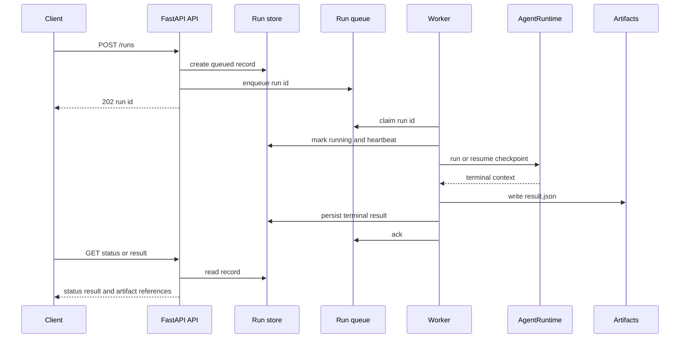

The deployed surface is deliberately narrow: a FastAPI process accepts typed **run lifecycle** requests, while one or more separate worker processes execute those runs through `AgentRuntime`. It is not a general remote interface for CLI commands, prompts, credentials, or arbitrary tools. The API returns after durable submission; the worker owns agent construction, execution, checkpoints, terminal outcome persistence, and result artifacts.



This shows the asynchronous run path and the ownership handoff between request handling and execution.

## HTTP boundary

`create_app()` creates a FastAPI application with documentation and OpenAPI routes disabled. Its unauthenticated probes are `GET /health` (process liveness) and `GET /ready` (store, queue, and artifact-root checks). All `/runs` routes use bearer authentication when `RE_SERVICE_API_TOKEN` is set:

| Route | Behavior |
| --- | --- |
| `POST /runs` | Validates a goal and scalar metadata/budget overrides, persists a `queued` run, enqueues it, and returns `202` with the run ID. |
| `GET /runs/{run_id}` | Returns lifecycle state, timestamps, errors, termination reason, claim count, artifact references, and whether a checkpoint exists. |
| `POST /runs/{run_id}/cancel` | Immediately terminalizes queued/resumable work; for running work, persists a cancellation request for the worker to observe between steps. |
| `POST /runs/{run_id}/resume` | Requeues only `failed` or `resumable` work; completed and cancelled work cannot be revived. |
| `GET /runs/{run_id}/result` | Is unavailable until a terminal state, then exposes output, termination, runtime counters, and artifact references. |

Goals are bounded to 1–10,000 characters, POST bodies are capped (1 MiB by default), CORS is absent unless explicitly configured, and the typed wire models exclude internal prompts, secrets, credentials, and tool interfaces. The API should remain a lifecycle facade: add a new hosted behavior by extending the request model, manager, registered worker factory, and result contract together—not by exposing a core agent or tool directly.

## Worker, runtime, and failure semantics

The worker polls and atomically claims queue entries up to `RE_WORKER_CONCURRENCY`, then builds the requested `agent_kind` from `AgentFactoryRegistry` and drives its planner/actor/observer/evaluator through `AgentRuntime`. The deployed default `planning_checklist` factory is deterministic and LLM-free; benchmark kinds are additionally registered by the worker entrypoint. New hosted agent types are an explicit extension point: register a factory and select it via scalar `metadata.agent_kind`. This does **not** turn every CLI agent into a remotely callable service agent.

Run state is `queued → running → completed|failed|cancelled`; a stale `running` run becomes `resumable` and is requeued. Workers heartbeat `updated_at`, suppress a fresh duplicate delivery, poll persisted cancellation after each completed runtime step, and retain terminal states against racing updates. A crash after a queue claim removes that queue row, so periodic stale-run recovery restores work. Checkpoint resume avoids repeating completed runtime steps, but delivery is at-least-once at the external-side-effect boundary: a crash after agent work but before terminal-state commit can repeat effects since the last checkpoint. Design custom factories and tools to tolerate that boundary.

Each terminal execution writes `result.json` under an artifact directory per run, records a SHA-256-bearing reference, and persists the result summary on the run record. Artifact names are reduced to a basename before writing, so an artifact cannot escape its run directory. The Compose API and worker share the artifact volume; the API returns references rather than serving artifact bytes.

## Persistence and deployment wiring

Without `RE_POSTGRES_DSN`, development uses a SQLite run store, SQLite checkpoints, and an in-memory queue; that queue is single-process only. Setting the DSN selects PostgreSQL-backed run records, checkpoints, and queue. PostgreSQL claims use `FOR UPDATE SKIP LOCKED` and delete the claimed row in the claim transaction, allowing concurrent workers while relying on stale-run recovery after worker loss. Both stores enforce terminal-state immutability in their atomic update guard.

Run locally as separate processes:

```bash
uv run python -m research_engineer.service.serve api
uv run python -m research_engineer.service.serve worker
```

`deploy/docker-compose.yml` is the production-shaped wiring: Postgres must become healthy before API/worker startup; the API is published on port 8000; both service containers use the same DSN and artifact volume; and the worker command overrides the Dockerfile’s API default. The image runs as non-root and installs the `[telemetry,service]` extras from vendored wheels. Copy `deploy/.env.example` rather than committing credentials; it requires a Postgres password and API token and exposes the operational limits for concurrency, stale-run timeout, polling, default runtime budgets, and optional step delay. See [Configuration](/openwiki/operations/configuration.md) for broader configuration guidance and [Safety](/openwiki/operations/safety.md) for policy details.

When `RE_SERVICE_ENFORCE_SAFETY=1`—as Compose sets it—the worker constructs a `ToolGateway` rooted at the artifact volume and a `SafetyController`, registers the deterministic sandbox tools, and fails a run closed if either component is absent. This gate is crucial for custom factory changes: adapter tool calls must attach to and route through `AgentRuntime`, not bypass the gateway/safety chain. The safety root limits agent-write space to the artifact volume; it is a policy control rather than a claim of OS-level workload isolation. See [Runtime behavior](/openwiki/runtime/runtime-behavior.md).

## Observability and verification

Service lifecycle events and `service_` metrics reuse the repository event bus and metrics/OTel bridge; telemetry failures are caught so they do not fail a run. The Compose collector receives OTLP on 4317/4318 but currently exports traces and metrics only to its debug exporter. Preserve this non-interference property when adding telemetry; observability is useful for queue depth, recovery, duration, failures, and correlation, not an execution dependency.

The interactive `research-engineer` CLI remains a separate entry surface for the specialized research agents. Its `benchmark run` command is the notable bridge: it exercises the production-style API/store/worker/runtime/gateway/safety path for regression measurement. For service changes, start with focused tests and then the deployment smoke path:

```bash
uv run python -m pytest tests/test_service_api.py tests/test_service_worker.py tests/test_service_safety_chain.py
scripts/smoke_test.sh [--down]
```

The focused tests cover request/auth constraints, lifecycle results, cancellation, state-race protection, persistence, recovery/checkpoint locking, concurrency, configuration, and fail-closed safety assembly. The smoke script validates the Compose handoff and a worker crash/recovery sequence. See [Testing overview](/openwiki/testing/overview.md).
