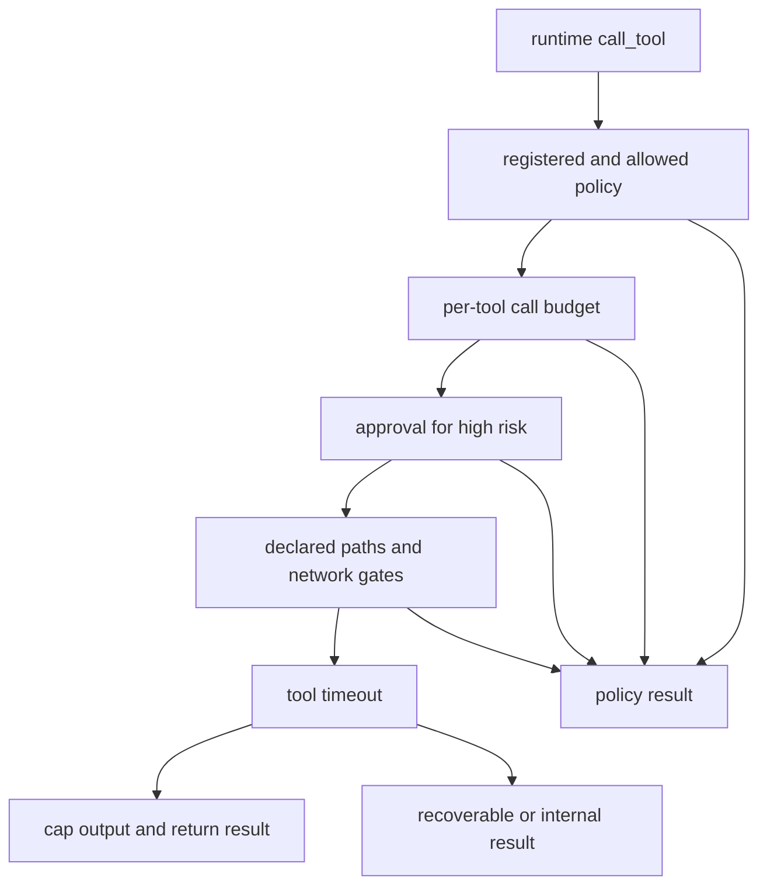

# Safety and Failure Boundaries

This repository has three distinct safety layers, with importantly different coverage:

1. **`ToolGateway`** is the policy decision point for tools called through `AgentRuntime.call_tool`.
2. **`SafetyController`** observes completed generic-runtime steps and can replan, require human intervention, or terminate a run.
3. **`TerminalTool` and task/loop configuration** constrain the terminal-first and research workflows, primarily through defaults, command allowlisting, validation, timeouts, and bounded repair.

They are not interchangeable, and none is OS/container isolation. In particular, the gateway sandbox validates *declared* path and network intent before a tool runs; it cannot contain a malicious subprocess. The terminal tool is used directly by `TaskAgent`, rather than automatically passing through the gateway. Treat gateway enforcement as an architectural requirement of the `AgentRuntime` integration, not as a claim that every tool use in the repository is centrally mediated.

## Gateway: the policy boundary for runtime-dispatched tools

A `ToolGateway` accepts only explicitly registered policies by default. A policy identifies a tool by stable name and supplies its risk level, permission, optional call/runtime/output budget, and approval requirement. Permission defaults are deny-all (`allow=False`, no filesystem, no network, workspace-only and read-only), while `register_tool()` deliberately creates an allowed policy when no custom policy is supplied. Consequently, adding a tool safely means registering an explicit, least-privilege `ToolPolicy`, not merely making a `Tool` implementation available.

The gateway execution chain and its refusal paths. A failed gate returns a result rather than raising a policy exception to the agent.

The dispatch order is policy/permission, call budget, approval, sandbox, tool execution, then output validation. Unknown names, denied policies, exhausted call budgets, denied approval, and sandbox violations are all terminal **for that invocation** (`failure_kind="policy"`); callers must not silently retry them. Timeouts and `ToolError` are returned as `recoverable`, whereas unexpected exceptions are `internal`. Successful string output is capped by the tool policy or the gateway's 1,000,000-byte default; error text is stripped of control characters and capped at 2,000 characters.

### Workspace, network, and approval gates

`ToolGatewayConfig` defaults to `default_deny=True`, an empty workspace, network disabled, a 60-second invocation timeout, and approval enforcement disabled. An empty workspace means filesystem access requested by a workspace-confined tool is refused. The sandbox resolves declared `repo_path`, `working_dir`, `path`, and `file_path` values and rejects paths outside configured roots; it also requires both a per-tool network grant and the global network switch. It only examines those well-known input fields and only enforces declared access, so it is not a substitute for process isolation or for validating arbitrary arguments embedded in a tool input.

Tools at `HIGH` or `CRITICAL` risk require gateway approval even if `requires_approval` was not explicitly set. A custom approval handler receives tool name, risk, policy description, call context, and policy before execution. The default callback handler is permissive without a callback unless `enforce_approval=True`; exceptions from a callback deny. This distinction matters operationally: the service safety chain enables enforcement and confines the gateway to its artifact directory, while an independently constructed default gateway does not enforce a missing approval handler.

Per-tool `max_calls` is guarded under an async lock, but its count is gateway-instance state rather than a run-scoped persistent counter. Budget a production deployment at both the runtime and gateway layers rather than assuming a restart preserves tool-call history.

## Runtime safety controller: contain unproductive or risky autonomy

When injected into `AgentRuntime`, `SafetyController` observes every completed step after ordinary runtime budget/progress processing and before an evaluator's completion signal can declare success. Its deterministic policy is authoritative: a safety termination wins over a claimed successful evaluation. Calls made by `AgentRuntime.call_tool` are recorded with gateway status, normalized argument hash, output signature, and configured risk; this is the link that lets the controller detect duplicate calls and policy failures.

The default `RuleBasedSafetyPolicy` evaluates in severity order. Gateway policy/security failures and exhausted runtime budgets are hard-limit conditions. It next considers no progress and diminishing returns, then consecutive step failures, repeated step/cycle signatures, and duplicate same-argument tool calls with unchanged results. Only afterward does it issue budget warnings or escalate recent high/critical-risk calls. Default actions are termination for policy failure, exhausted budget, five stagnant steps, and diminishing returns; replan for three consecutive failures, loops, and duplicates; pause for approval for high/critical risk; and continue with a warning at 80% of a configured runtime budget. Replans are capped at two by default; a further replan request becomes terminal.

A `PAUSE_FOR_APPROVAL` decision is resolved by the safety controller's separate `PauseApprovalGate`, after the gateway's per-call approval chain has already run. No gate, a denial, or a callback exception fails closed into termination. An approval records the highest approved risk level for the run so future non-policy-failure calls at that level or below do not pause repeatedly. An optional LLM advisor can attach explanatory text only; it cannot change the deterministic action.

Safety history is checkpointable under `ctx.metadata["safety_state"]`, including bounded signature, tool-call, and decision histories. This preserves loop/duplicate detection across a runtime checkpoint and resume; corrupt serialized state is logged as a warning and replaced with a fresh state rather than crashing dispatch. Safety-observation and tool-call recording are deliberately best effort: an observer/telemetry failure does not interrupt the tool call or run. This is an availability boundary, so operators should monitor its logs rather than assume that a missing safety event stopped execution.

## Coding and research workflow containment

`TaskConfig` starts with `dry_run=True` and `run_tests=False`. In the legacy task flow, generated patches are applied only when the caller explicitly sets `dry_run=False`; the task result still records generated patch count and diff. Tests are opt-in and default to `uv run pytest` with a 600-second task-config timeout. Delegated mode bounds review/test repair with `max_repair_iterations=2` (0–10), preventing an unbounded repair loop. Failures are retained in `TaskStep.error` and top-level `TaskResult.error`; test diagnostics are available as `test_exit_code`, `test_stdout`, `test_stderr`, and, in delegated mode, `test_failures` and review feedback.

The research-loop configuration is also dry-run by default. Its maximum is five iterations (validated to 1–100); optional GPU-hour and USD budgets, target/no-improvement stopping, and a three-iteration stagnation window constrain experimentation. Approval mode is opt-in and creates plan, implementation, and next-iteration gates. `stop_on_error` defaults to `False`, so iteration failures can be recorded and the loop can proceed; enable it where continuing after a failed experiment is unsafe. Loop state records the error, pending approval, cumulative costs, and final status, while individual iteration records carry their own `error` and `status`.

### Terminal tool: useful restrictions, but an unsafe edge to isolate

`TerminalTool.run_command` does not invoke a shell directly: it splits a string into argv and uses `asyncio.create_subprocess_exec` in `repo_path`. The executable basename must be in `ALLOWED_COMMAND_PREFIXES`, output is capped at 1 MB, and a timeout kills the process and returns `success=False`, `exit_code=-1`, and `stderr` such as `Command timed out after 300s`. Dry-run at the *terminal command input* level returns the assembled command without executing it. Patch application first invokes `patch --dry-run -p1`; a non-clean patch returns a failed `TerminalOutput` without applying it.

These controls are not sufficient to describe the terminal tool as sandboxed:

- The allowlist includes `bash` and `sh`, whose arguments can run arbitrary shell content; it is an executable-prefix filter, not an argument policy.
- `_resolve()` accepts an absolute `file_path` unchanged and joins relative paths without resolving/checking containment. Thus `read_file` and `write_file` are not guaranteed to stay below `repo_path`; task callers must be trusted or routed through a stronger containment layer.
- `apply_patch`, `git_status`, and `git_diff` call subprocesses directly, and `TaskAgent` calls `TerminalTool.execute()` and `PatchApplicationTool` directly. They do not inherit the gateway's registration, approval, declared-path, or network checks.

For code that needs a safety boundary, prefer a registered gateway tool with a workspace-limited policy, disable network unless genuinely needed, require approval for side-effecting high-risk tools, and keep the terminal tool behind a trusted orchestration boundary. Do not represent the current task-agent path as gateway-enforced merely because both components have timeouts and output caps.

## Failure signatures and operator evidence

| Boundary | Expected signature | Where it is surfaced | Safe response |
| --- | --- | --- | --- |
| Gateway refusal | `UNKNOWN`, `DENIED`, `BUDGET_EXCEEDED`, `APPROVAL_DENIED`, or `SANDBOX_VIOLATION`; `failure_kind="policy"` | `ToolExecutionResult.status`, `.error`, `.call_id`, and `tool_gateway` `tool_call_end` event | Correct registration/policy/workspace/approval; do not retry unchanged. |
| Gateway transient/tool failure | `TIMEOUT` or `ERROR` with `recoverable`; unexpected failures use `internal` | `ToolExecutionResult.error` and `tool_gateway` end event | Retry only if caller policy permits and inputs/environment changed; investigate internal failures. |
| Runtime safety stop | Runtime termination `SAFETY_TERMINATED`, `NO_PROGRESS`, `BUDGET_EXCEEDED`, or `APPROVAL_REQUIRED`; reason begins `safety:` | `AgentExecution.termination`, `AgentContext.termination_reason`, `safety_decision` event, and checkpoint metadata | Use `reason_code`/trigger to adjust the plan, budget, or approval wiring rather than overriding the decision. |
| Safety pause unavailable or denied | `approval_required.*` or `approval_denied.*` decision | Termination reason and `PauseRequest` stored in decision metadata | Wire a `PauseApprovalGate` and obtain an explicit decision; autonomous continuation is intentionally blocked. |
| Task stage failure | Step or task `FAILED`, with error; test exit/status output may be present | `TaskStep.error`, `TaskResult.error`, test fields, review and repair fields | Inspect the failed stage and diff; mutation may already have occurred when dry-run was disabled. |
| Terminal command/patch failure | `TerminalOutput.success=False`; timeout has exit code `-1`; patch validation reports `Patch would not apply cleanly` | `TerminalOutput.error`/`stderr`/`exit_code`; task test fields | Do not assume process isolation or rollback. Fix the command/patch, then inspect `git_diff`/`git_status`. |

Gateway emits best-effort structured events named `tool_call_start`, `tool_approval_requested`, `tool_approval_resolved`, and `tool_call_end` under `kind="tool_gateway"`, correlated by `call_id`, tool, agent, and run. The controller emits `kind="agent_runtime", event="safety_decision"` with action, trigger, reason code, mandatory flag, and warnings. In the runtime's metadata, `tool_call_log` is a compact per-call `{tool, status}` audit shape. Event emission failures are intentionally swallowed, so result objects and persisted context are the primary evidence for enforcement outcomes.

## Change and test guidance

Changing a policy, gateway adapter, terminal operation, or repair behavior should preserve these invariants:

- Policy failures must return a classified gateway result and remain non-retryable; they must reach the safety controller when the runtime path is used.
- Approval callback errors must deny, and missing E5 pause approval must terminate rather than continue.
- A timeout must bound the awaited child process and leave a usable result object; output/error caps must remain in place.
- Detector inputs must stay deterministic and checkpoint-restorable. A custom safety policy must make the same decision from the same progress/risk/state triple.
- The dry-run default must not silently become a mutation default, and repair loops must retain a finite configured cap.

Focused regression coverage belongs around the gateway's ordered refusal/result classification, sandbox path/network checks, risk ordering and approval behavior; safety detector thresholds, approval fail-closed behavior, replan exhaustion, checkpoint restoration, and runtime termination mapping; and terminal allowlist, dry-run, timeout, output truncation, patch preflight, and path-containment behavior. The last category should explicitly cover the current absolute/parent-path edge before relying on a claim of repository confinement.
