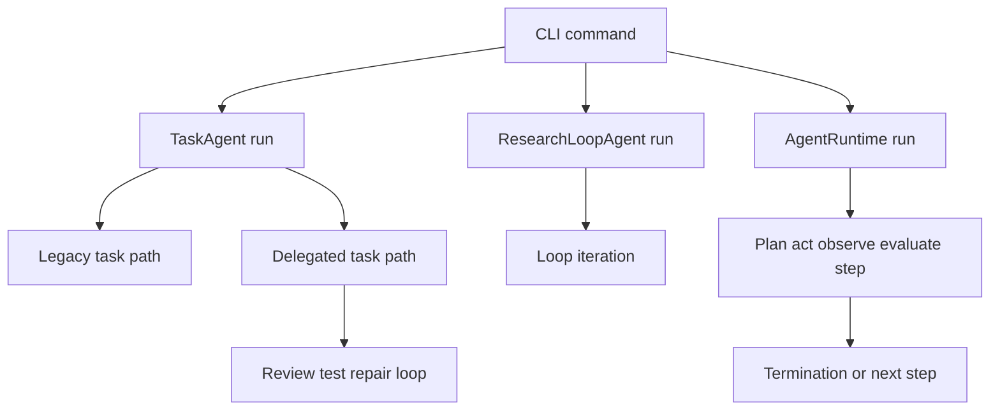

# Runtime Behavior

This is the home for runtime findings that should change how an agent modifies or operates this codebase. It complements the static descriptions in [Architecture Overview](/openwiki/architecture/overview.md), [Agent System](/openwiki/concepts/agents.md), [Tools and Safe Execution](/openwiki/concepts/tools.md), and [Configuration and Runtime Controls](/openwiki/operations/configuration.md).

## Evidence scope

This documentation run did **not** receive a readable trace aggregate, bucket counts, trace URLs, latency values, token values, or root-error signatures in the repository workspace. Consequently, no sampled-trace metric, rate, tool-usage count, retry frequency, or trace URL is asserted below. This is intentional: absent aggregate evidence must not be reconstructed from code or inferred from test cases.

The registers below keep evidence types separate:

- **Observed** means directly summarized from the pulled traces. There are no reportable observations for this pull because its aggregate was unavailable to this writer.
- **Correlated** means source-inspected behavior that is the mechanism to check against a future trace sample.
- **Hypothesis** means a change or investigation to validate, not a conclusion about production.

## Runtime findings & opportunities

Ranked for an agent deciding where to instrument or change behavior:

1. **No trace-backed failure or outlier bucket is available for this pull.**
   - **Trace evidence:** no readable bucket summary or trace URL was supplied in the workspace; do not treat this as evidence of healthy operation.
   - **Code symbol:** `AgentRuntime._handle_error()` and `AgentRuntime._check_termination()` in `src/research_engineer/runtime/runtime.py`.
   - **Implication:** preserve the existing structured error and termination events when changing execution flow. The next trace pull should be able to distinguish fatal errors, recoverable retries, budgets, timeout, cancellation, and no-progress termination rather than collapsing them into a generic failed root.

2. **The terminal task and research-loop entrypoints do not automatically use the generic `AgentRuntime`.**
   - **Trace evidence:** none available for this pull; this is a source correlation, not a statement about trace coverage.
   - **Code symbol:** `TaskAgent.run()`, `ResearchLoopAgent.run()`, and CLI factories `_get_task_agent()` / `_get_loop_agent()`.
   - **Implication:** instrumenting only `AgentRuntime` will not establish runtime coverage for the principal CLI task and loop paths. Before interpreting missing runtime events as inactivity, determine which entrypoint generated the trace and add compatible correlation/event emission at that orchestration boundary if needed.

3. **The repair loop has a bounded but potentially multiplicative review/test shape.**
   - **Trace evidence:** none available for this pull; no latency or cost multiplier is quantified here.
   - **Code symbol:** `TaskAgent._run_basic_repair_loop()`.
   - **Implication:** changes to reviewer, tester, or repair behavior should retain the `max_repair_iterations` bound and record a cycle-level outcome. A future outlier investigation should first group delegated task traces by configured repair cap and actual repair count before attributing latency to a model or tool.

## Execution paths worth correlating

This shows distinct orchestration paths whose logs and costs must not be merged merely because they all run agents.

`research-engineer task` constructs a `TaskConfig` and calls `TaskAgent.run()`. Its default path analyzes a repository, optionally retrieves memory, plans, implements, diffs, and optionally tests. With `--delegate`, it switches to a distinct pipeline with review/test/repair. `research-engineer loop run` constructs a `LoopConfig` and invokes `ResearchLoopAgent.run()` directly. The separately usable `AgentRuntime` runs injected plan/act/observe/evaluate callables and owns generic policies, events, checkpointing, and optional tool-gateway/safety integration.

This separation matters operationally. A runtime trace named for a CLI task cannot be assumed to have `AgentRuntime` step events, runtime budget enforcement, gateway dispatch, or checkpointing; those features only apply where callers instantiate and wire the generic runtime. Conversely, generic-runtime traces do not establish that the task or research-loop workflows experienced the same safeguards.

## Observed register

**No reportable observations for this pull.** The available connector configuration identifies the LangSmith project, but not the pulled trace summary. In particular, there is no source for any of the following: error-bucket signatures, outlier root latency, baseline median latency, token/cost totals, tool counts, retry chains, unused installed capabilities, or whether configured ceilings were approached. All cost and latency statements therefore remain intentionally absent rather than being presented as zero or normal.

## Correlated register

### Generic runtime: retry and terminal semantics

`AgentRuntime.run()` initializes a correlation context, emits a `start` event, executes until a terminal condition, emits an `end` event, and returns an `AgentExecution` containing the final context and termination reason. Each iteration executes planner, actor, observer, and evaluator in order. Completed steps accumulate tool-call, token, and USD fields, emit a structured step event, then re-check budgets; evaluation can signal completion through `done`.

An exception in a phase is classified by `classify_error()` unless a caller provides an override. `asyncio.TimeoutError`, `ConnectionError`, `OSError`, and non-permanent `ProviderError` are recoverable. A recoverable error is recorded on a step and the loop retries on a subsequent step; it becomes terminal only after the count exceeds `AgentPolicy.max_recoverable_errors` (default three). Other errors terminate immediately. Therefore a future trace signature with repeated phase errors may be intended retry behavior, while four default-classified transient failures represent exhaustion rather than an unbounded retry.

The runtime checks cancellation plus configured step, tool-call, wall-clock, cost, and token ceilings before every step and again after resource consumption. Unset `AgentBudget` dimensions are unbounded. Score-bearing evaluations independently drive no-progress termination after the configured stagnation window. Cancellation is cooperative: `cancel()` is checked between phases and does not interrupt an in-flight callable.

Checkpoint failure is deliberately non-fatal: `_checkpoint()` logs and emits `checkpoint_failed` but does not propagate. A trace showing a completed execution with checkpoint errors would thus be expected by design, but it would still be an operational durability outlier worth triage. `resume()` validates the checkpoint schema and acquires a lock before returning context; completion releases that lock best-effort.

### Generic runtime: observability boundaries

`AgentRuntime.call_tool()` rejects calls unless a `ToolGateway` has been injected. With a gateway, it attaches each dispatched call to the active step and appends a compact `{tool, status}` record to context metadata. When a safety controller is present, the same call is supplied to it for duplicate-call and risk analysis. This produces a concrete instrumentation expectation: sampled tool counts from generic-runtime traces should reflect gateway-dispatched calls, not arbitrary direct `Tool.execute()` calls made by task and loop agents.

The event emitter is best-effort. It includes run/execution IDs, goal, state, phase, step, tool-call count, tokens, and cost fields, while event-bus failures are swallowed. This protects task execution from observability outages but means an absent event stream alone cannot prove a path did not run.

### Task and terminal boundaries

`TaskAgent` is terminal-first but constructs its own sequence. The legacy path fails fast only when repository analysis fails; implementation failure sets the top-level error and skips diff/test, while unexpected exceptions are caught and finalized as failed results. Repository-memory construction and retrieval are explicitly best-effort: both failure paths return an empty context rather than failing the task. Planning similarly falls back to a rule-based plan when no LLM provider is available. These fallbacks should be identified separately in future traces because a completed task can have avoided the expected memory or LLM path.

Delegated tasks build a new `DelegationFramework` per task run. The basic repair loop performs review, then either repairs a rejected review or tests; failed tests can trigger repair and another diff until `max_repair_iterations` is exhausted. The loop uses `range(max_repair_iterations + 1)`, so the configured cap means at most that many repairs but up to one additional review/test attempt. `TaskConfig` defaults to no tests, dry run, no delegation, a 600-second test timeout, and two repair iterations; the CLI exposes the repair cap but not its timeout field.

`TerminalTool._run_command()` accepts only configured command prefixes and reports launch failure, nonzero exit, and timeout as structured unsuccessful output. Its default command timeout is 300 seconds; timeout kills the subprocess and returns exit code `-1`. This is distinct from `TaskConfig.timeout_seconds` (600 seconds), which is supplied to the task test path. Tool output is capped at one million bytes. `TerminalTool._apply_patch()` first runs `patch --dry-run -p1` with a 30-second timeout and only then performs a real application with a 60-second timeout. These tool ceilings are code-defined points to compare to observed terminal error signatures; this pull does not establish that any was hit.

### Research loop: containment and degraded reporting

`ResearchLoopAgent.run()` stores the running loop record before entering its iteration loop. An iteration exception becomes a failed iteration; `stop_on_error=True` stops immediately, while `False` allows the loop to continue and persist the failed iteration. After normal iteration processing it updates estimated GPU and tracked LLM cost, stores memory/graph records, and evaluates stopping conditions. Report generation is explicitly best-effort: any report exception is swallowed and the returned `LoopResult` simply has no generated report files. Therefore lack of report artifacts is not, on its own, proof that the loop itself failed.

The CLI loop factory is intentionally partial: `_get_loop_agent()` supplies memory, literature, experiment, and evaluation agents but does not inject planner, coding, repository, or research agents. `_run_iteration()` conditionally skips a phase when its corresponding agent is absent. This is a load-bearing construction detail for interpreting future traces: a loop started through this CLI factory may not exhibit planning or implementation work even though the orchestration class supports those phases.

## Hypothesis register

1. **Hypothesis — add an entrypoint-level correlation bridge.** Give `TaskAgent.run()` and `ResearchLoopAgent.run()` a run/trace ID and emit compact start, phase, terminal, retry/repair, and fallback events compatible with `AgentRuntime` fields. Verify on a new sample that CLI traces then separate legacy tasks, delegated tasks, and research loops without recording raw prompts or outputs.

2. **Hypothesis — make fallback and swallowed-error outcomes observable.** Emit counters/statuses for repository-memory unavailable, rule-based planning fallback, loop iteration error continued, and report-generation failure. Verify that this exposes which apparently successful roots ran in degraded mode and whether those modes correlate with latency or failed artifacts.

3. **Hypothesis — normalize timeout provenance.** Include both the task test timeout and terminal command timeout in structured terminal outcomes. Verify whether future timeout outliers cluster at 30, 60, 300, or 600 seconds, which would identify patch validation, patch apply, general terminal command, or task test controls respectively.

4. **Hypothesis — instrument repair-cycle economics before changing the cap.** Capture actual repair count and per-cycle review/test/repair durations on delegated tasks. Only then change `max_repair_iterations`; otherwise a lower cap may hide failures and a higher cap may multiply an unmeasured outlier.

## Focused verification

`tests/test_runtime.py` provides the executable contract for the generic runtime: phase ordering, each budget dimension, cooperative cancellation, fatal versus recoverable error behavior, error-classifier override, no-progress handling, event emission, and adapter execution. It proves expected in-process semantics, not that any of them was exercised in the sampled LangSmith traces.

Before changing runtime behavior, run the focused tests and the affected workflow tests, then inspect the next pulled trace aggregate by bucket. For every reported metric, label it as observed over that pull, retain the trace URLs rather than raw run content, and compare it to the relevant limit above. Do not promote an anomaly-weighted bucket count to an error rate.
