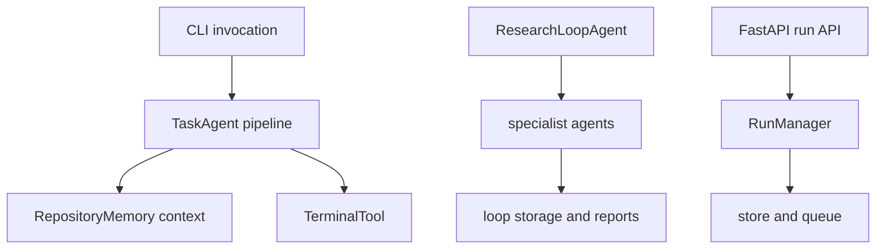

The test suite is primarily a **boundary and failure-semantics suite**, not merely a collection of unit checks. It combines deterministic fakes and temporary repositories with a smaller set of explicitly network-dependent tests. This keeps the normal suite suitable for offline CI while exercising the contracts that make autonomous changes safe: orchestration ordering, persisted state, tool confinement, API lifecycle, and externally visible CLI validation.

Run the suite from the repository root with:

```bash
uv run pytest
```

Pytest discovers `tests/test_*.py`, makes `src` importable, and applies a 300-second per-test timeout using the thread method. Tests marked `@pytest.mark.network` are skipped when neither configured arXiv probe host accepts a short TCP connection. These controls matter when extending tests: use fakes for ordinary behavior; add the marker only for behavior that genuinely requires a live service. [Pytest configuration](repo://pyproject.toml#L40-L63) and [network skip fixture](repo://tests/conftest.py#L1-L51).

## Coverage shape

The highest-value tests cross a meaningful handoff, then assert the observable outcome rather than implementation details:



This diagram shows the principal boundaries targeted by focused tests: command/API entrypoints, orchestrators, persistence, and controlled side effects.

- **Entrypoints**: `test_cli.py` uses Typer's `CliRunner` to protect required arguments, type conversion, help text, output choices, and safe handling of missing repositories or caches. It intentionally allows some operational commands to return either success or failure when the fixture does not control external work; its strongest assertions are input-boundary checks, not proof of a full research run. [CLI tests](repo://tests/test_cli.py#L10-L237)
- **Agent orchestration**: task and research-loop tests inject async fakes for collaborators. They verify ordering, context propagation, status finalization, stop conditions, generated outputs, and graceful degradation without optional dependencies. [Task tests](repo://tests/test_task_agent.py#L14-L206) [research-loop tests](repo://tests/test_loop_agent.py#L163-L236).
- **Repository intelligence**: a synthetic repository gives the memory suite a controlled symbol, configuration, dependency, and test graph. The suite protects both retrieval relevance and persistence/refresh behavior, then checks the TaskAgent integration that turns retrieved context into planning input. [Repository-memory tests](repo://tests/test_repository_memory.py#L32-L110) [facade and integration tests](repo://tests/test_repository_memory.py#L456-L593).
- **Side-effect boundary**: terminal tests create a disposable Git repository and exercise filesystem, patch, search, and process outcomes—including invalid inputs and nonzero exits—without touching a production checkout. [Terminal-tool tests](repo://tests/test_terminal_tool.py#L14-L48) [failure and patch cases](repo://tests/test_terminal_tool.py#L51-L116) [file/search/patch cases](repo://tests/test_terminal_tool.py#L119-L311).
- **Service boundary**: API tests run entirely in-process with SQLite, an in-memory queue, and temporary artifact/checkpoint paths. They protect request validation and security defaults as well as the asynchronous run lifecycle without needing containers. [Service API fixture and scope](repo://tests/test_service_api.py#L1-L36).

The broader `tests/` tree extends this pattern across runtime, checkpoints, safety controls, gateway behavior, streaming, observability, evaluation, experiments, literature, and delegation. When a change crosses one of those seams, find the existing focused suite rather than adding a shallow assertion to an unrelated command test.

## Orchestrator regressions

### TaskAgent: a coding turn is a staged contract

The default task pipeline analyzes a repository, retrieves repository-memory context, plans, implements, captures a diff, and conditionally runs tests. A failed repository-analysis step finalizes immediately; later step failures are recorded in the result and cause overall failure. The delegated mode expands the sequence into research, architecture, review/test, and bounded repair work. Tests should therefore assert both the returned `TaskStatus` and the step list—not just whether a fake collaborator was called. [TaskAgent pipeline](repo://src/research_engineer/agents/task_agent.py#L133-L233) [delegated pipeline](repo://src/research_engineer/agents/task_agent.py#L239-L338).

`test_task_agent.py` is the fast regression home for this contract. It proves the normal fake-backed run retains the implementation ID, generated patch count, diff, and test output; disabling `run_tests` removes exactly that optional stage; repository analysis failure yields a one-step failed result; and a missing LLM uses the rule-based planning fallback. [Task-agent focused cases](repo://tests/test_task_agent.py#L112-L206).

For changes to delegation or repair, extend the dedicated delegation/self-repair suites as well. Do not make the basic task test depend on a real model, terminal process, or repository scan: the injected fake collaborators are what make an ordering or failure regression diagnosable.

### Research loop: persist, learn, decide, stop

`ResearchLoopAgent` owns loop state. It creates and stores a running loop record, recalls memory for each iteration, runs the available specialist phases, persists the iteration, updates metrics and cumulative cost, stores memory/graph relationships, evaluates stopping conditions, then best-effort generates reports during finalization. An iteration exception becomes a failed iteration; `stop_on_error` determines whether the loop itself stops immediately. [Research-loop lifecycle](repo://src/research_engineer/agents/research_loop_agent.py#L222-L406) [iteration phase ordering and approval gates](repo://src/research_engineer/agents/research_loop_agent.py#L412-L492).

The loop suite protects several non-obvious invariants:

- Max-iteration, target-achieved, stagnation, and budget conditions terminate with the expected `LoopStatus` and stopping condition.
- An experiment exception can still yield a stopped recorded iteration when configured to continue rather than abort.
- Recalled memory is formatted and passed to *both* the planner and coding agent; completed iterations store memory and graph relationships.
- The next-command decision distinguishes improvement, regression, absent metrics, and a stagnation window, including the `higher_is_better` direction.
- Query methods and report generation observe persisted loop state and actual report paths, while missing optional agent dependencies degrade to an empty memory result rather than crashing.

[Loop stopping and recovery tests](repo://tests/test_loop_agent.py#L203-L421) [memory-flow and decision tests](repo://tests/test_loop_agent.py#L424-L633) [persistence/report/no-dependency tests](repo://tests/test_loop_agent.py#L635-L717).

## Memory and tool safety boundaries

### RepositoryMemory: index correctness is not enough

Repository memory is repository-scoped and couples AST indexing, a symbol graph, embeddings/vector lookup, hybrid retrieval, and SQLite persistence. `build()` replaces the stored index; `refresh()` uses stored hashes and updates only when files changed; query returns no results until an index exists. Context assembly includes relevant symbol signatures, dependency/caller information, related tests, and files for prompt injection. [RepositoryMemory lifecycle](repo://src/research_engineer/memory/repository_memory.py#L45-L125) [query, graph, and context assembly](repo://src/research_engineer/memory/repository_memory.py#L149-L280).

The corresponding tests deliberately prove the edges that make retrieval safe to rely on: test modules/functions and `TESTS` edges are indexed, noise directories are omitted, unchanged incremental scans report no change, modified files are identified, SQLite-loaded instances can retrieve without rebuilding, and an unindexed memory returns an empty context. They also assert that a TaskAgent accepts an injected memory object and retrieves a string context, preserving optional-memory behavior. [Indexer and graph tests](repo://tests/test_repository_memory.py#L164-L249) [persistence, refresh, and empty-index tests](repo://tests/test_repository_memory.py#L456-L546) [TaskAgent memory integration](repo://tests/test_repository_memory.py#L554-L593).

### TerminalTool: failure responses are part of the API

`TerminalTool` restricts `run_command` to a small command-prefix allowlist, runs it in `repo_path`, supports dry-run and timeout, and reports process failure as a typed unsuccessful output with the exit code. It size-caps read/command output; `search_code` returns an unsuccessful output for invalid regex; and patch application dry-runs the system `patch` command before applying the diff. [Terminal constraints and dispatch](repo://src/research_engineer/tools/terminal.py#L36-L67) [process behavior](repo://src/research_engineer/tools/terminal.py#L168-L287) [search and patch validation](repo://src/research_engineer/tools/terminal.py#L355-L396) [patch dry-run](repo://src/research_engineer/tools/terminal.py#L434-L499).

Keep tests for an added terminal operation paired across: validation, successful behavior, bounded/no-result behavior where applicable, and its failure mode. In particular, preserve tests that `rm` is not allowlisted, an arbitrary operation raises, a bad diff does not modify the tree, a missing read returns `success=False`, and a nonzero allowed command remains observable instead of being treated as success. [Terminal invariants](repo://tests/test_terminal_tool.py#L51-L116) [operation failure cases](repo://tests/test_terminal_tool.py#L133-L158) [patch and allowlist cases](repo://tests/test_terminal_tool.py#L258-L320).

## Service lifecycle and security

The HTTP service is intentionally a non-blocking control plane. `POST /runs` validates, persists, and queues a run; it does not execute agents. The manager cancels queued/resumable work immediately, flags running work for worker-side cancellation, requeues only failed/resumable runs, and can recover stale running records as resumable work. [API entrypoints](repo://src/research_engineer/service/api.py#L185-L302) [RunManager ownership and lifecycle](repo://src/research_engineer/service/manager.py#L3-L156).

`test_service_api.py` should be the first target for edits to public request/response behavior. It asserts 422 validation for empty, oversized, or wrongly typed goals; 413 body limits; optional bearer auth on run endpoints but not health probes; no OpenAPI endpoint; and CORS disabled by default. It then covers submit/query, unknown-run 404s, unavailable pre-terminal results, idempotent cancellation, invalid resume conflicts, readiness dependency names, and correlation/metric telemetry. [Service validation and exposure tests](repo://tests/test_service_api.py#L39-L100) [run lifecycle and telemetry tests](repo://tests/test_service_api.py#L102-L180).

A safe service change preserves the distinction between liveness (`/health`) and dependency readiness (`/ready`), preserves unauthenticated probes when tokens are configured, and does not accidentally turn a submission endpoint into synchronous agent execution. The API implementation disables docs/OpenAPI and only installs CORS middleware when origins are configured. [Service security and readiness implementation](repo://src/research_engineer/service/api.py#L104-L162) [readiness checks](repo://src/research_engineer/service/api.py#L201-L219).

## Cross-cutting regression strategy

Some failures appear only when an otherwise valid subsystem meets runtime policy. The checkpoint tests cover serialized context metadata, store backends, crash recovery, resume locking, and observability. The safety suite checks real progress does not trip duplicate-call detection, while identical calls/results and cyclic state do. These are the suites to change alongside runtime, checkpoint, or autonomy-policy code—not a task or CLI test. [Checkpoint coverage scope](repo://tests/test_checkpoint.py#L2-L35) [checkpoint serialization invariant](repo://tests/test_checkpoint.py#L109-L153) [safety coverage scope and false-positive cases](repo://tests/test_safety.py#L2-L7) [duplicate and cycle detector tests](repo://tests/test_safety.py#L131-L189).

For an end-to-end feature, test the narrowest new invariant first, then add one handoff test where data crosses ownership boundaries. For example: a repository-memory schema change needs index/store/refresh coverage plus a TaskAgent context assertion; a new service state needs manager transition coverage plus API status mapping; a new tool action needs side-effect and rejection coverage plus the agent step that consumes its output. This keeps regressions local, reproducible, and meaningful.

## Change checklist

1. **Identify the owner and seam.** Is the change a CLI boundary, an agent stage, memory persistence/retrieval, a terminal side effect, runtime safety, or the service lifecycle?
2. **Preserve the negative path.** Add or update an assertion for malformed input, unavailable optional dependency, nonzero command, failed collaborator, forbidden action, or illegal state transition as appropriate.
3. **Use controlled collaborators.** Prefer `tmp_path`, `CliRunner`, `TestClient`, SQLite/in-memory adapters, and async fakes. A live provider or internet dependency belongs behind `@pytest.mark.network`.
4. **Assert externally useful state.** Status, persisted/queryable records, outputs/artifacts, queue behavior, context passed across a seam, and on-disk changes are stronger than call-count-only tests.
5. **Run the focused file first**, then `uv run pytest` before merging. If behavior spans runtime safety or persistence, include the relevant checkpoint/safety suite in the focused run.
