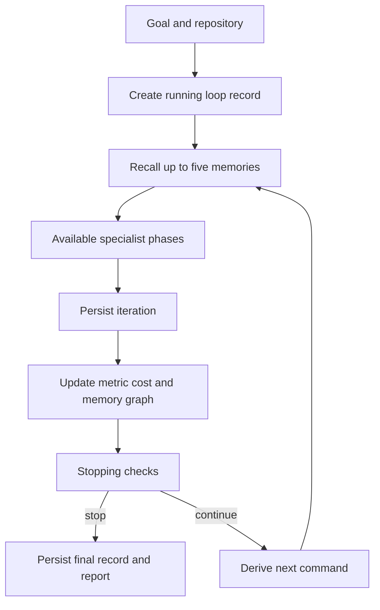

# Research Loop Workflow

`ResearchLoopAgent` is the orchestration boundary for an iterative research program. It turns a goal and target repository into a sequence of optional specialist phases, records what happened, tracks a chosen metric and estimated spend, and returns a `LoopResult`. It is distinct from the generic `AgentRuntime`: the loop owns its own lifecycle and does not automatically inherit generic-runtime checkpointing, budget enforcement, gateway dispatch, retry policy, or events. See [Agent System](/openwiki/concepts/agents.md), [Memory and Retrieval](/openwiki/concepts/memory.md), [Tools](/openwiki/concepts/tools.md), and [Runtime Behavior](/openwiki/runtime/runtime-behavior.md).

## Entrypoints and construction

The programmatic entrypoint is:

```python
await ResearchLoopAgent(...).run(goal, repo_path, config=config, approval_callback=callback)
```

The CLI exposes the same workflow through `research-engineer loop run GOAL --repo PATH`. It maps its metric, budget, approval, dry-run, literature, output, and iteration flags into `LoopConfig`, then runs the async agent. `loop list`, `get`, `iterations`, `iteration`, `search`, and `report` query persisted records or regenerate a report.

A significant integration detail is that `_get_loop_agent()` injects memory, literature, experiment, and evaluation agents, but **not** planner or coding agents. The orchestrator supports planning and implementation when they are explicitly supplied; the normal CLI factory will skip those absent phases. Consequently, do not assume a CLI loop performs a planning or code-generation turn merely because those phases exist in the general workflow.

## Control and data flow



*The loop persists its initial and final records, while each completed pass feeds memory, metrics, cost, and stopping decisions into the next pass.*

1. **Initialize and persist.** `run()` overlays the supplied goal and repository path on the selected configuration, creates unique `loop_...` and `iter_...` identifiers, marks mutable `LoopState` as `running`, and persists a `LoopRecord` before executing any iteration. The record includes serialized configuration, status, later iteration count, metric, stop information, and memory IDs.
2. **Recall.** Before every iteration, the loop asks the optional memory agent for up to five items relevant to the goal. Recall failure and a missing memory agent both become an empty context, rather than failing the loop. Retrieved entries are reduced to type, tags, and a short content field, then supplied to planning and implementation when those agents are present.
3. **Execute an iteration.** The iteration starts as `iterating`. Literature discovery runs on iteration one, and on later iterations only when `skip_literature_after_first=False`. The supported order is literature → planning → implementation → experiment → evaluation → decision. Each specialist call is optional and wrapped in its own broad exception handler, so a failed or absent phase usually leaves IDs/metrics empty and permits later phases to run. Experiment execution chooses `state.next_command`, then `experiment_command`, then `python train.py`; evaluation reads the experiment record and chooses the configured target/primary metric, or the first available metric.
4. **Persist and learn.** The resulting `LoopIteration` is appended to state and stored in SQLite before metric/cost/memory work. The loop updates a running best only when `target_metric_name` is configured, respecting `higher_is_better`. It charges a fixed 0.5 GPU-hour heuristic per stored iteration, converts it using `cost_per_gpu_hour`, and additionally adds the process-wide LLM usage tracker total. It then records a success or failure memory, an empirical insight when metrics exist, and—when graph support exists—relationships from loop to iteration, and iteration to paper, experiment, evaluation, and created memories.
5. **Stop or continue.** After persistence and learning, the checker evaluates terminal criteria. On continuation, the loop returns to `running`, derives a rule-based `NextCommand`, and uses it on the next experiment pass.
6. **Finalize and report.** The final loop record is overwritten with final status, aggregate fields, stop condition/reason, and all memory IDs. Report generation is attempted afterward; `LoopResult.generated_files` contains Markdown and JSON paths only if that best-effort step succeeds.

## State machine and iteration phases

`LoopStatus` models `created`, `running`, `iterating`, `awaiting_approval`, `evaluated`, `stopped`, and `failed`. The implemented `run()` path creates a running state, changes it to `iterating` for a pass, marks it `evaluated` after persistence/learning, then either returns to `running`, reaches `stopped` through the stopping checker, or becomes `failed` on a configured/fatal loop-level error. `LoopIteration.phase` records the last phase reached rather than a full per-phase event log.

The `awaiting_approval` status is available in the model but is not assigned by the loop implementation. With `approval_mode=True`, gates run after planning, implementation, and evaluation. A callback exception is treated as rejection; without a callback, the code records `pending_approval` but returns approval, so approval mode does **not** pause an autonomous CLI invocation. A callback rejection returns a stopped iteration; however, the outer loop still persists it, runs normal stopping checks, and can reset state to `running` if no condition matches. Treat a rejected gate as an iteration-level outcome, not a reliable terminal pause, unless the caller also enforces that policy.

## Meaningful stopping and failure conditions

Stopping is evaluated only after an iteration has been stored, charged, and learned from. The checker returns the first matching condition in this priority order:

| Priority | Condition | Behavior |
| --- | --- | --- |
| 1 | `target_achieved` | Requires target metric name/value and a best value. Compares `>=` for higher-is-better and `<=` otherwise. |
| 2 | `max_iterations_reached` | Stops once `current_iteration >= max_iterations`. |
| 3 | `budget_exceeded` | Stops when accumulated GPU hours or USD cost reaches or exceeds a configured budget. |
| 4 | `no_improvement` | Requires a fully populated trailing metric window and at least one prior metric. Stops when the window’s best improvement is below `improvement_threshold`. |

These limits are post-iteration checks, not admission controls: the loop can perform and charge the iteration that crosses a budget. The `NextCommand` advisory is separate from terminal stopping. It recommends `continue` after a measured improvement, `correct` after regression, `rediscover` after a stagnant window, or `none` if there is no target or metric; it does not itself stop the loop or dynamically inject new literature work.

There are two different error paths:

- An exception escaping `_run_iteration()` creates a failed `LoopIteration`. With `stop_on_error=True`, state becomes `failed` immediately and finalization still persists the loop and attempts reporting. With the default `False`, the failed iteration is stored and the loop may continue through its ordinary stop checks.
- Most phase-level failures do **not** escape `_run_iteration()` because literature, planner, coder, experiment, and evaluation calls swallow exceptions. This is degraded completion, not retry: no phase retry/backoff is implemented, and an experiment error can yield an evaluated iteration with missing metrics rather than a failed one.

Reporting is also non-fatal: report-generator exceptions are discarded and a valid loop result can have no artifact paths. Conversely, storage calls are outside the phase-level suppression and may cause the enclosing loop to fail.

## Configuration and operational controls

`LoopConfig` defaults to five iterations, lower-is-better metric interpretation, dry-run experiments, literature only on the first iteration, a three-iteration stagnation window, threshold `1e-4`, `stop_on_error=False`, `output/loops`, and USD conversion at 2.0 per estimated GPU-hour. `max_iterations` is constrained to 1–100; stagnation is at least two iterations. Use a named `target_metric_name` together with a target value if target completion and best-metric tracking are required.

A conservative invocation is:

```bash
research-engineer loop run "Reduce validation loss" --repo ./my_repo --max-iterations 3 --target-metric loss --target-value 0.1 --dry-run
```

Use `--no-dry-run` deliberately: it is passed to the experiment agent and can permit actual experiment execution. The loop itself does not centrally enforce tool permissions or generic-runtime budgets; experiment command allowlists/timeouts and other execution controls belong to the underlying tools. See [Configuration and Runtime Controls](/openwiki/operations/configuration.md).

## Persistence, retrieval, and reporting

`LoopStorageTool` uses SQLite at `data/research_engineer.db` by default, with separate `research_loops` and `loop_iterations` tables. Loop records are searchable by goal/stopping reason and filterable by status; iteration records are ordered by iteration number and can filter by loop, paper, status, or diagnostic text. Both use insert-or-replace semantics, so finalization updates the same loop ID. This supports the CLI inspection commands and `generate_report(loop_id)`, which reloads the stored configuration and iteration history before producing a report.

The report generator writes the following under `<output_dir>/<loop_id>/`:

- `research_report.md`, with summary, methodology, iteration table, successful metrics/memory IDs, failed approaches, conclusion, and serialized configuration;
- `research_report.json`, containing serialized loop, iterations, and configuration.

The report’s fixed methodology wording names every specialist even when optional collaborators were absent. For an accurate account of an individual run, use its persisted iteration IDs, phases, statuses, and artifacts rather than treating that boilerplate as proof that every phase executed.

## Runtime evidence and focused verification

The available runtime documentation contains **no readable trace aggregate or sampled loop trace**, so it confirms neither the number of actual turns nor production fallback/stop frequencies. It does establish from source correlation that loop CLI runs bypass `AgentRuntime`; generic runtime retry, checkpoint, gateway, and event assumptions therefore do not apply automatically. It also notes the partial CLI construction and best-effort reporting described above.

Use focused fakes and temporary SQLite/output paths when modifying this workflow:

```bash
uv run pytest tests/test_loop_agent.py tests/test_loop_tools.py tests/test_loop_models.py tests/test_loop_cli.py
```

The most valuable regression cases cover stop priority and metric direction, post-iteration budget behavior, stagnation prerequisites, persistence/query round trips, report paths and content, memory propagation to both planner and coding collaborators, next-command branches, missing optional dependencies, and the distinction between continued iteration failure and terminal `stop_on_error` behavior.
