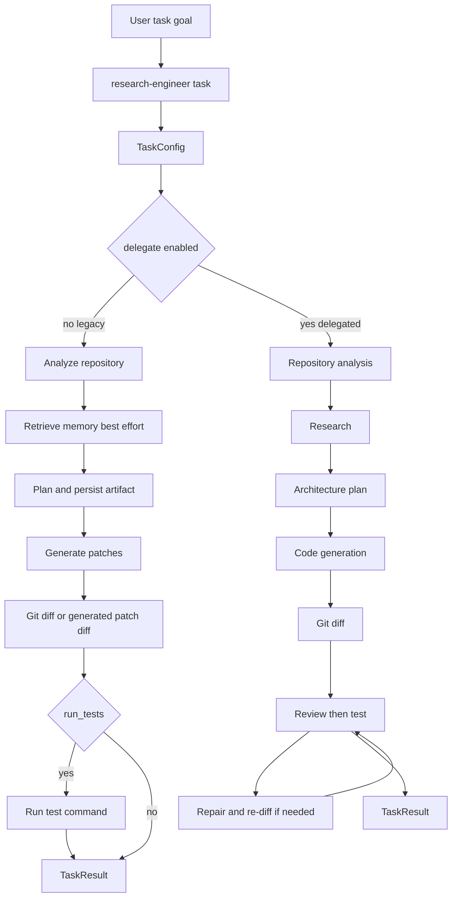

# Terminal Task Agent Workflow

`research-engineer task` is the user-facing, terminal-first coding turn. It accepts a goal and target repository, constructs a `TaskConfig`, and calls `TaskAgent.run()`. The default **legacy** mode is patch-first: it analyzes the repository, obtains best-effort memory, writes a plan artifact, generates patches, displays a diff, and runs tests only when requested. The materially different **delegation** mode coordinates specialist agents through a shared context, adds research, architecture, review, testing, and bounded repair.

```bash
research-engineer task "Fix gradient clipping" --repo ./my_repo --run-tests
research-engineer task "Add EMA checkpoint support" --repo ./my_repo --delegate --max-repairs 3
```

The command can print console, JSON, or Markdown results. JSON is the complete machine-readable `TaskResult`; the human formats include ordered steps, a truncated diff/output in console mode, and (when delegated) repair count, review issues, and parsed test failures.

## Entry configuration and safe default

`TaskConfig` is the run contract. Its defaults prioritize inspection over mutation:

- `dry_run=True`: legacy mode generates patches but does not apply them.
- `run_tests=False`: no test step is performed unless `--run-tests` is supplied.
- `test_command="uv run pytest"` and `timeout_seconds=600`: apply to the legacy test step and are passed to delegated testing.
- `stream=True`: planning tokens can stream to stdout; `--no-stream` makes interactive output quiet.
- `output_dir="output/tasks"`: the legacy planner writes a timestamped Markdown plan under `output/tasks/tasks/` by default.
- `delegate=False`; if enabled, `max_repair_iterations` defaults to 2 and is constrained to 0–10.

`TaskAgent.run()` overwrites a supplied configuration's `goal` and `repo_path` with its explicit arguments, so those arguments are authoritative for the result and execution. The CLI does not expose `timeout_seconds`; callers embedding `TaskAgent` can set it directly in `TaskConfig`.

## Two execution modes



*The CLI selects either the backward-compatible legacy sequence or the specialist-agent sequence; only delegated mode contains the repair loop.*

### Legacy mode: analyze, plan, implement, diff, optionally test

1. **Repository analysis** calls `RepositoryAgent.analyze(..., enable_llm=False)`. Its generated documentation files become artifacts on the `analyze_repo` step.
2. **Repository memory** is deliberately best-effort and does not produce a `TaskStep`. When the optional memory subsystem is importable, the agent constructs `RepositoryMemory`, builds an index if absent, then retrieves up to eight context items for the goal. Build/load/query errors become an empty context, not task failure. See [Memory and Retrieval](/openwiki/concepts/memory.md).
3. **Planning** asks the configured LLM for a concise plan grounded in that memory context. Provider absence or a completion error falls back to a deterministic four-step plan. The plan text is written to a `plan_<epoch>.md` artifact before implementation.
4. **Implementation** calls `CodingAgent.implement()` to generate patches and implementation artifacts. If `dry_run=False`, it invokes `PatchApplicationTool` with explicit approval flags and records applied/failed counts in the step summary. A no-test mutation produces a warning in that summary; it does not make tests run.
5. **Diffing** runs `git diff`. If Git fails or has no working-tree changes—common for dry-run patch generation—the agent uses generated patch diff content as the result instead.
6. **Testing** runs only when `run_tests=True`, using `TerminalTool.run_command` with the configured command and timeout. The terminal output maps directly to `test_exit_code`, `test_stdout`, and `test_stderr`.

### Delegation mode: shared context and role/capability routing

Delegation creates a new `SharedTaskContext` for each task. It is the communication channel between agents and accumulates repository summary, memory and research context, plan, implementation ID/count, diff, generated files, review feedback/issues, test diagnostics, and repair metadata. `DelegationFramework` maps a requested capability to the first registered agent, yielding deterministic routing while permitting an extension to register a different first provider.

The task coordinator registers adapters for repository analysis, research, and code generation/repair, plus an architect, reviewer, and terminal-backed `TestAgent`. It dispatches this ordered pipeline:

1. repository analysis;
2. research—paper analysis when `paper_input` is supplied, otherwise lightweight goal context;
3. best-effort repository-memory retrieval;
4. architecture plan;
5. code generation;
6. `git diff`;
7. review/test/repair.

Unlike legacy mode, the basic delegated loop dispatches testing even if `run_tests=False`; `run_tests` affects the optional structured self-repair framework's `require_tests` configuration. Code generation adapters accumulate generated files and patch metadata but do not apply legacy patches through `PatchApplicationTool`; users should inspect the diff and the coding agent's generated artifacts before separately applying changes.

## Review, test, and repair semantics

The basic delegated loop starts at iteration zero and performs at most `max_repair_iterations` repairs, with up to one additional review/test attempt (`range(max_repair_iterations + 1)`). It sets `ctx.repair_iteration`, then:

- reviews `ctx.diff`; a rejected review triggers repair plus a fresh diff while budget remains;
- otherwise dispatches `TestAgent` with the configured test command/timeout;
- stops if `ctx.test_exit_code == 0`; otherwise repairs and refreshes the diff until budget is exhausted.

`ReviewerAgent` writes structured approval, feedback, and issues into the context. It uses an LLM when available and falls back to checks for bare `except:`, debugging `print()`, `TODO`/`FIXME`, and potential trailing-newline problems. `TestAgent` writes exit code, stdout, stderr, and up to 20 parsed pytest `FAILED`, `ERROR`, or `AssertionError` messages.

An injected `SelfRepairFramework` replaces this basic loop. For each configured repair cycle it analyzes the failure into a typed report, creates ranked strategies, selects the first strategy above its confidence threshold, dispatches repair, refreshes the diff, then validates review and—only when `run_tests=True`—tests. It terminates on success, iteration budget exhaustion, no viable strategy, or repeated failure-category stagnation. `TaskAgent` converts each cycle into a `repair` step; a partial repair cycle is currently recorded as completed, while failure/stagnation is recorded as failed.

## Result, artifacts, and failure state

Every run gets `task_<12 hex chars>` and always returns a `TaskResult`, including caught unexpected exceptions. It records ordered `TaskStep` entries with a step type, completion/failure state, start/end times, duration, summary, artifacts, and an optional error. The final object additionally carries patch count, implementation ID, unified diff, generated files, processing time, timestamp, and top-level error. Delegated results also expose `delegated=True`, repair count, review feedback/issues, and parsed test failures.

| Stage | Can fail independently? | Continuation and evidence |
| --- | --- | --- |
| Analyze repository | Yes, fatal in both modes | A failed analysis is appended, copied to top-level `error`, and finalizes immediately. |
| Memory retrieval | Yes, degraded only | Exceptions return empty context and are not represented as a step error. |
| Plan | LLM availability can fail | LLM failure falls back to a rule-based plan; filesystem failure while persisting the plan is caught by the outer task handler. |
| Implement/code generation | Yes, fatal | The failed step is recorded; legacy skips diff/test and delegated finalizes immediately after code generation failure. |
| Patch application | Per-patch failures are independent | Legacy implementation summarizes applied/failed counts and error messages but does not itself convert partial application into a failed `TaskStep`; inspect the summary, artifacts, and diff. |
| Diff | Yes | A failed diff step is recorded. Legacy skips tests after it; generated patch content can rescue an empty/failed Git diff. Delegated flow continues into review/test, but final status is failed if any recorded step failed. |
| Review/test | Yes | Basic delegated processing may continue through a failed review/test attempt to repair, but every failed step contributes to final failure even if a later attempt succeeds. |
| Repair | Yes, bounded | Repair invocations/cycles are recorded and end when the configured cap, no-strategy, or stagnation condition is reached. |

This distinction is important: `TaskStatus.COMPLETED` means no recorded `TaskStep` failed; it is not proof that memory was available, an LLM was used, patches were applied, or tests ran. Conversely, a completed delegated task can carry a self-repair cycle with a `partial` outcome because that outcome maps to a completed repair step. Consumers that need a release gate should inspect the ordered steps, test exit code, diff, and mutation state, not only final status.

## Terminal and mutation boundary

The terminal tool supplies `run_command`, filesystem read/write, code search, patch application, Git status, and Git diff. Command execution uses `cwd=repo_path`, an executable-prefix allowlist, a timeout, and capped output; task tests receive a 600-second configured timeout. `git diff` uses a 30-second tool timeout. Generated patch application validates inputs, dependency order, and patch applicability; non-dry-run application can create `.patch_backups` and rollback metadata.

These are guardrails rather than a complete isolation boundary. The command list includes interpreters and shells such as `python`, `bash`, and `sh`; allowlisting checks only the executable prefix. Terminal file paths can be absolute or contain parent traversal, and task-agent terminal calls bypass the generic runtime's tool gateway. Keep task use confined to a trusted repository; preserve dry-run as the default; explicitly opt into mutation and tests; use narrow allowed commands; and inspect `git diff`/`git status` after failed or partial application. For the detailed trust-boundary limitations and stronger gateway option, see [Safety and Failure Boundaries](/openwiki/operations/safety.md) and [Tools and Safe Execution](/openwiki/concepts/tools.md).

## Operations and observability

The task workflow is a direct orchestrator and does **not** automatically run through `AgentRuntime`. Consequently, generic runtime events, budgets, tool counts, checkpoints, and gateway enforcement do not establish coverage for a CLI task. `TaskResult`/`TaskStep` and terminal outputs are the primary in-process record of its behavior. Preserve result fields and cycle-level state when changing orchestration so operators can distinguish an analysis failure, optional-memory degradation, plan fallback, partial patch application, diff failure, test failure, and exhausted repair budget.

There were no readable sampled production trace aggregates available for the associated runtime analysis. Therefore this page makes no claim about observed terminal tool use, turn counts, latency outliers, dead paths, or hot paths. The code-correlated operational finding is that bounded repair can multiply review/test work; correlate future traces by `delegate`, configured repair cap, actual `repair_iterations`, step durations, and terminal exit codes before adjusting that cap. See [Runtime Behavior](/openwiki/runtime/runtime-behavior.md) for the evidence scope, the separate execution-path map, and the instrumentation gap for `TaskAgent`.

## Focused verification

Run the focused suites after changing this workflow:

```bash
uv run pytest tests/test_task_agent.py tests/test_task_cli.py tests/test_terminal_tool.py tests/test_delegation.py tests/test_self_repair.py
```

`tests/test_task_agent.py` protects the legacy step sequence, optional test omission, fatal repository-analysis behavior, result fields, and rule-based planning fallback. `tests/test_terminal_tool.py` exercises a disposable Git repository and command allowlisting, dry runs, nonzero exits, capped reads, filesystem/search behavior, Git diff, and patch preflight. `tests/test_delegation.py` protects mode selection, delegated completion/error handling, the CLI options, and bounded delegation behavior; `tests/test_self_repair.py` covers the injected structured-repair integration. For suite conventions and broader regression selection, see [Testing Overview](/openwiki/testing/overview.md).
